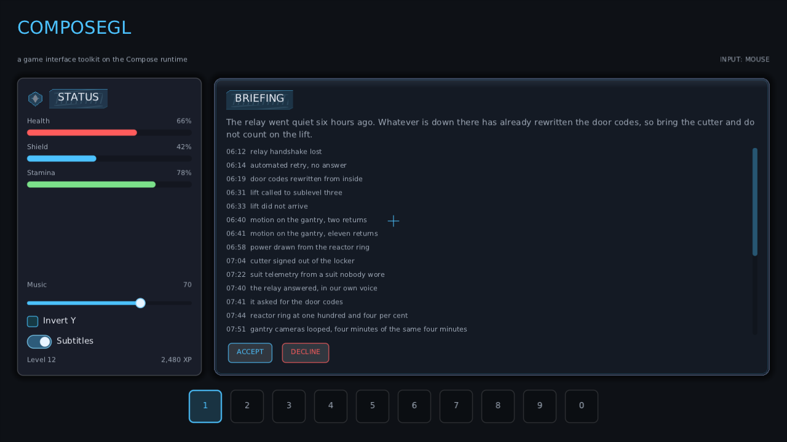

# ComposeGL

A user-interface toolkit for games, built on Jetpack Compose's runtime and drawn with OpenGL.

**Being rebuilt.** Read [the design](docs/superpowers/specs/2026-09-09-runtime-ui-design.md) for
where it is going, and [spike S6](docs/superpowers/spikes/s6-runtime-ui.md) for the evidence it
works.

## What it is

Compose is the brain: the compiler plugin, the state system, and recomposition, which is the part
that makes an interface redraw only when something actually changed. Everything below the neck —
the widgets, the layout, the drawing, the input — is ours, drawn through LibGDX with a sprite batch
and a font.

The toolkit itself is a Kotlin Multiplatform module: every line of it is common code, and it is
compiled for a JVM *and* for Linux native on every build. That second target is not a product — it
is the thing that stops "this is portable" from being a claim nobody checks. A backend is what ties
it to a machine, and there are two of those.

It also means we are free to build the toolkit games actually need — skins from a texture atlas,
focus that works on a gamepad, animations on a clock the game can pause — instead of a
general-purpose one bent into shape.



*The example, in `composegl-demo`, on its LOADOUT tab with a callsign being typed. Every panel, border, shadow, bar and letter is drawn by our own
renderer from a tree the Compose runtime maintains. The STATUS panel is drawn by the shader — one
quad for its corner, border and shadow together. The BRIEFING panel is nine-patch art out of a
texture atlas, and the gap between its frame and its text is a number in the atlas file rather than
a number in the source. The headings sit on a ribbon whose hatch repeats sideways and stretches
downwards. The whole screen costs five draw calls: every glyph at every size, and the white texel
solid colour is drawn from, share one page — so the only texture changes left are the game's own
art.*

## The thing it is for

A game interface should cost nothing when nothing is happening. In the spike, a still interface
redrew **4 times in 119 frames** — once at startup, once per button press. Switch an animation on
and it redraws every frame; switch it off and it stops. That behaviour is the whole reason to use
Compose, and it survives without Compose UI.

## Status

Nothing is shippable yet, and there is no release. What works today is the picture above: layout,
the modifier chain, the renderer, fonts, nine-patch art, and all three ways in — a mouse, a
keyboard and a gamepad, with hit testing, focus and key routing behind them. The chips and the
hotbar in the example light up under the pointer, respond to a click, draw a focus ring that Tab
and a d-pad move, and answer the number keys.

Every colour, corner, padding and slice in that picture comes from
[one JSON file](composegl-demo/src/main/resources/ui/demo.skin.json); not one of them is written in
the example's Kotlin. Save the file while the example is running and it changes on the next frame.
A skin that will not parse names the line and suggests the nearest region or key that would have
worked, and a broken save leaves the last skin that worked on screen. The widget set has started:
`Text`, `Image`, `Button`, `IconButton`, `Checkbox`, `RadioButton`, `Toggle`, `Slider`,
`ScrollArea`, `LazyColumn`, `LazyRow`, `Panel`, `Dialog`, `Tabs`, `TextField`, `Bar`, `Hotbar`,
`RadialCooldown`, `DamageNumberLayer`, `Reticle`, `Tooltip`, `Typewriter`, `PromptGlyph`, `Notifications` and `MinimapFrame` ship with
the toolkit, and the example is built from them. Typing works the whole way through: a caret that blinks
and stops blinking mid-word, selection by shift or by dragging, double-click for a word, word-wise
movement, the system clipboard through whichever backend is running, and a field that scrolls
sideways so a long name never types itself off the edge.

Animation is in too, and it names a clock. `animateFloatAsState`, `animateColourAsState` and an
`Animatable` a game drives itself, over tweens, springs and the usual easings — but an animation
belongs to `Clock.Ui` or `Clock.World`, and the game decides which clocks advance. Freezing the
world does not freeze the pause menu sitting on top of it, and a world animation resumes from where
it stopped rather than jumping to where it would have been. An animation that has arrived
unsubscribes, so a screen full of settled animations costs exactly as many redraws as a screen with
none: zero, and there is a test that drives a hundred frames to prove it.

The game widgets start with the health bar, which is where the clocks earn their keep. The fill
moves the instant the value does; a ghost bar behind it holds for a moment and then drains down to
meet it, so a player sees *how much* they just lost rather than only that they lost some. Two hits
in a row keep draining towards the newer value instead of the trail jumping back up and starting
again, healing has no trail at all, and the whole thing runs on `Clock.World`, so a paused game is
not still visibly bleeding. Thresholds name their own fill style — "red below a quarter" is one
line at the call site and a colour in the skin file — and a bar that low breathes.

Next to them is the ability cooldown: a dark wedge that covers what is left and sweeps away
clockwise, the seconds remaining on top of it, and a flash when it comes back. Triggering one that
is already running is ignored rather than starting it again, so the key a player is mashing cannot
push the end of it further away. The wedge covers a square icon's corners rather than a circle
inside it, and it is exact at any size: the edge of a rectangle is four straight lines, so the
sweep needs no arc and no smoothness setting. Drawing it added the one primitive this toolkit's
short drawing interface was missing — a triangle fan — which is also what a radial menu and a
compass needle are made of.

The bar those go in is a widget too. A hotbar answers the number keys, a click and a pad at once,
because a player uses all three; an empty slot looks different from a slot holding something that
cannot be used right now, because those mean different things to somebody deciding what to press;
and a press that would do nothing — empty, switched off, out of charges, still cooling down — is
not drawn as a press and never reaches the game. The number keys have to work wherever the player
is, and a key event only reaches a widget while focus is inside it, so the press is hoisted into a
`HotbarState` a game puts on its screen or calls from its own bindings.

Damage numbers are the first thing here that belongs to the world rather than the screen. A hit
puts a number over the thing that was hit, it floats, fades and goes; a critical is bigger and
lasts longer. Two hundred of them at once is an ordinary moment in a game, so the whole layer is
one node that measures each number once and draws the rest straight onto the canvas — no node per
number to make and throw away, and a test that watches the thread's own allocation counter says it
costs nothing per frame once they are up. Where a number goes is the game's to say: it hands over
an anchor that writes a world position and a projection that turns it into a screen one, so a
number over a walking target walks with it, and one behind the camera is simply not drawn.

The crosshair is the other half of that. It draws at the centre of whatever box it is given, so it
is right at every window size without the game working out where the middle is; the spread animates
towards what the game says it is, kicking faster than it settles, because a crosshair that snaps
open reads as a glitch rather than as recoil. A landed shot flashes four ticks — one marker, so
firing faster does not stack markers into a bright blob, which is the bug every hand-rolled one
has. A hostile target changes its colour and nothing else.

Tooltips are a host round a screen rather than a modifier, because a tooltip has to be drawn over
the panel it belongs to and over whatever is next to that panel. The delay is the screen's, not each
widget's: a player who is already reading one tooltip and runs along a row of icons has decided to
look, so the next appears at once — every toolkit that stores the delay per widget makes a toolbar
feel like it is arguing. It flips above the thing it belongs to rather than hanging off the bottom
of the screen, slides back on at the sides, and appears on **focus** as well as hover, which is the
whole of the pad story: nothing is ever hovered on a pad. That needed one new primitive,
`Modifier.onFocusWithin`, for the difference between "this node has focus" and "focus is somewhere
in here".

Dialogue types itself. The whole line is measured before the first character is shown, so the box
is its final size from the start and nothing underneath jumps as the words arrive — the one thing a
typewriter has to get right. It rests at punctuation, which is what makes it read like somebody
talking rather than a machine printing, and a player who has read ahead presses the button and gets
the rest at once. An effect can take each character on its own — a shake as it lands, a fade up, a
colour — and it costs what it costs: with an effect the line is drawn a character at a time rather
than a line at a time, which is why there is a fast path without one.

An interface can also live *in* the world rather than on top of it — a screen on a wall, a
terminal, the display on a gun. It is the same tree, laid out the same way, drawn by the same
passes; the only difference is where the pixels land, and a test asserts the two are call for call
identical. The backend draws it into a texture the game maps onto whatever quad it likes, and what
comes out is premultiplied, so `GL_ONE, GL_ONE` gives a hologram for free rather than a grey haze
over every transparent pixel. Both backends do it, both are checked pixel for pixel against the
same drawing on the HUD, and resizing one fifty times hands every framebuffer back — asserted by
the names being handed out again rather than marching upwards. The point of doing it this way at
all is the last part: **a panel is drawn only when its tree changes**, so a terminal nobody is
looking at costs one comparison a frame.

The minimap is a frame with a hole in it. A game's map is its own — a texture it renders, a tile
grid, a mesh — so the toolkit draws the border, clips a rectangle and hands it over, and the game
either draws with our canvas or reaches the backend underneath with `raw { }`. What is left is the
chrome: an arrow at the edge for every objective that is off the map, and the cardinal letters. The
edge arrow is the part worth getting right — it is a ray meeting a **rectangle**, not a circle,
because a minimap is hardly ever square and the round version puts an objective due east in the
middle of nothing. A live map is redrawn every frame, because everything on it moves outside the
composition; one that is not live is not redrawn at all.

What the game has to say is a queue, not a list. A chest with twenty things in it or a quest that
finishes four steps at once is an ordinary moment, and a widget that shows everything it is handed
covers the screen at exactly the wrong time — so three are up, the rest wait, and the ones waiting
are counted rather than drawn. Each card slides in, holds and goes; clicking one takes it away
early and lets the next in, which is how a player gets through a burst. What runs out is a clock's,
so a queue on the world's clock holds behind a pause menu instead of emptying behind it. Past the
backlog the **oldest** waiting one is dropped, because a player who set off twenty pickups wants
the last few, not a queue still playing a minute later. An empty queue composes nothing, runs
nothing and asks for no frames.

Button prompts are the toolkit's answer to a question every game asks badly: `PromptGlyph(Action.Confirm)`
draws **E** on a keyboard, **A** on an Xbox pad and **✕** on a PlayStation one, and it changes on
the frame the player puts one down and picks the other up — nothing reloaded, no event sent to each
prompt, because what device is in use and what it is bound to are both Compose state. A rebinding
screen writes the new binding into `Prompts` and every prompt on screen follows. An action nobody
bound draws a dash rather than an empty box. The glyph sits in the middle of a sentence on the
sentence's own baseline, which is fiddlier than it sounds: a prompt is drawn a size smaller than
the words around it, so lining the boxes up puts the letter off the line, and it lines up the
baselines instead. A skin with real button art names `"prompt.pad.south"` and the plain box is the
fallback, so a skin that draws half the buttons is not half broken.

The gamepad half has never met a gamepad: there is no pad on the machine this is written on, so
the button layouts, the hot-plugging and the axis directions are written to what LibGDX's and
GLFW's own contracts say and have not been measured.

| | |
|---|---|
| `composegl-ui` | the toolkit. Multiplatform, and depends on the Compose runtime and coroutines |
| `composegl-gdx` | the LibGDX backend: renderer, fonts, input. The one to use |
| `composegl-lwjgl3` | a second backend, on raw OpenGL and stb_truetype. Exists to disagree |
| `composegl-testing` | the scenes both backends draw, and the golden comparison |
| `composegl-demo` | the example in the picture |
| Design | [`docs/superpowers/specs/2026-09-09-runtime-ui-design.md`](docs/superpowers/specs/2026-09-09-runtime-ui-design.md) |
| Spike, and its numbers | [`docs/superpowers/spikes/s6-runtime-ui.md`](docs/superpowers/spikes/s6-runtime-ui.md) |
| Everything else written down | [`docs/`](docs/README.md) |
| Work | the [issues](https://github.com/wildware-uk/composegl/issues), milestones M5 onwards |

## Testing

Almost nothing here needs a GPU. A widget's job is to decide *what* to draw and *where*, and a
decision can be asserted directly — so the toolkit is tested through a canvas that writes down what
it was asked to draw instead of drawing it.

What is left is the part only a GPU can answer: whether the pixels are right. That is a handful of
golden images, compared with a tolerance that survives two different software rasterisers
disagreeing about the last bit of an antialiased edge.

Both backends draw the same six scenes, out of `composegl-testing`, and each keeps its own goldens
beside its own tests. They are not shared on purpose: FreeType and stb_truetype will never agree on
a glyph pixel for pixel, and a tolerance loose enough to cover that would catch nothing. What the
two sets are for is the comparison a person makes by looking at them — shapes, positions and
clipping have to match, and where they do not, the toolkit has leaked something into one backend
that the other never heard about.

```bash
./gradlew build                                           # includes compiling the toolkit for Linux native
./gradlew check                                           # everything that needs no display
xvfb-run -a ./gradlew :composegl-gdx:test                 # the renderer, on software OpenGL
xvfb-run -a ./gradlew :composegl-lwjgl3:test              # and the same scenes with no LibGDX
COMPOSEGL_UPDATE_GOLDENS=1 xvfb-run -a ./gradlew :composegl-gdx:test   # after an intended change
```

A failed golden writes the actual, the expected and a difference map into `build/screenshots`, and
CI keeps them.

## The previous version

Until 2026-09-09 this repository was a different thing: Compose UI, rendered by Skia through skiko,
into the game's framebuffer. It worked, it was tested, and it is preserved at the tag
**`skia-final`** — `git checkout skia-final` for the code, the demos and its own README.

It was abandoned for one reason: skiko publishes no Android or iOS binary, and building one is not
work this project can do. Everything it taught us is in `docs/superpowers/spikes/s1`…`s6`.

## Running it

```bash
./gradlew :composegl-demo:run                             # the example in the picture
./gradlew :composegl-demo:runGl                           # the same example, with no LibGDX in it
SPIKE_S6_HEADLESS=1 ./gradlew :spikes:s6-runtime-ui:run   # the redraw experiment, no window needed
```

Everything here has only ever run on Mesa's software rasteriser. No real GPU, no macOS, no Windows,
and nothing on a phone.
