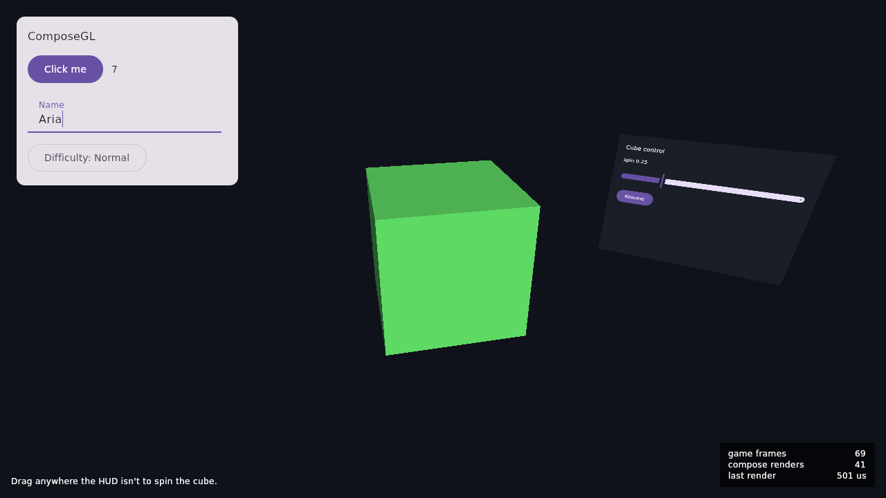
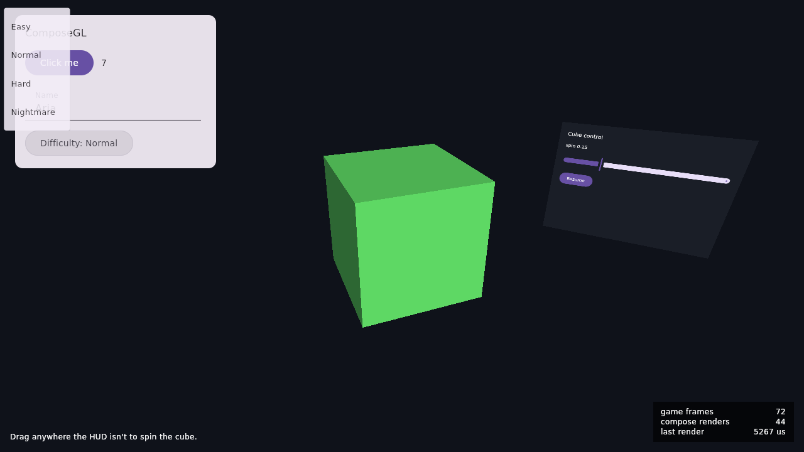
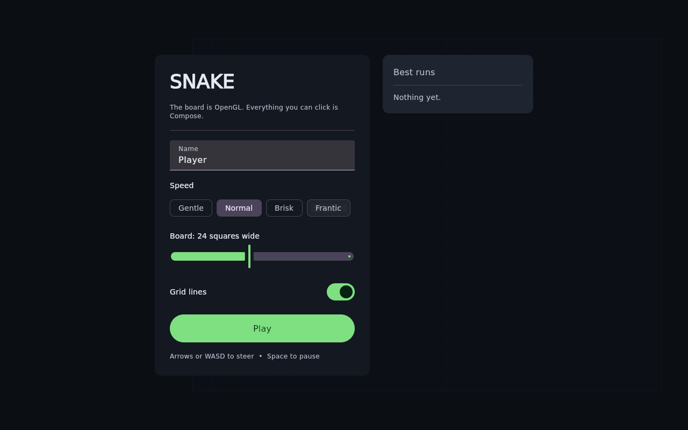
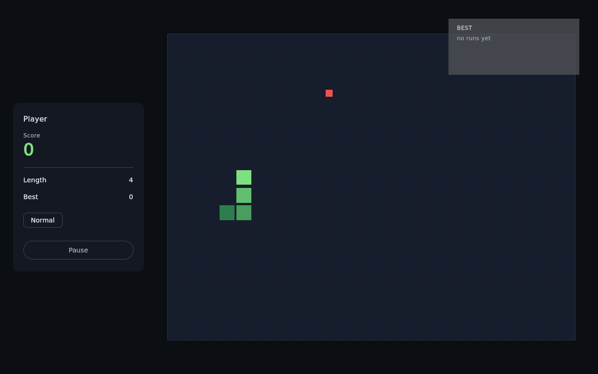

# ComposeGL

Draw your game's UI with Jetpack Compose, inside your game's own OpenGL frame.

Compose decides and lays out the UI. Skia draws it. Your engine supplies the paper — an OpenGL
framebuffer — and blits the result as one quad. ComposeGL is the desk that holds them together.

First engine: LibGDX on desktop JVM.



*The demo. Material 3 panel on the left; the tilted quad on the right is a second Compose UI, in
the 3D world, clicked by raycast. The counters bottom-right are the argument: 69 game frames, 41
Compose renders, and the gap keeps widening while the HUD sits still.*

```kotlin
class MyGame : ApplicationAdapter() {
    lateinit var ui: ComposeOverlay

    override fun create() {
        ui = ComposeOverlay()
        ui.setContent { Hud(viewModel) }
        Gdx.input.inputProcessor = InputMultiplexer(ui, gameInput)  // UI gets first refusal
    }

    override fun resize(width: Int, height: Int) = ui.resize(width, height)

    override fun render() {
        drawWorld()
        ui.update()
        ui.draw()
    }

    override fun dispose() {
        ui.dispose()
        ComposeGdx.dispose()
    }
}
```

## Why it is cheap

Compose only redraws when the UI actually changes. Everything else is one textured quad.

A HUD that is not changing costs **zero** Compose work per frame — not a cheap redraw, none at all.
`ComposeOverlay.stats` reports it, and the demo puts the numbers in the corner so you can watch:
600 game frames, 3 Compose renders.

The exception worth knowing: a text field with the caret blinking in it is an animation, so it
redraws every frame while it has focus.



*A dropdown, open over the game. On desktop, a Compose popup would normally open its own operating
system window, which would be absurd here. This one is drawn onto our canvas, inside the game's
frame.*

## Requirements

**OpenGL 3.0 or newer.** LibGDX defaults to GL 2.0, so you almost certainly have to say:

```kotlin
Lwjgl3ApplicationConfiguration().apply {
    setOpenGLEmulation(Lwjgl3ApplicationConfiguration.GLEmulation.GL32, 3, 2)
}
```

Skia's GL backend needs it. Without it you get a `ComposeGlUnsupportedException` that says so.

**The Skiko native library for the machine you run on.** Compose brings the Java bindings; the
native half ships as one artifact per OS and CPU, and you pick it:

```kotlin
runtimeOnly("org.jetbrains.skiko:skiko-awt-runtime-linux-x64:0.150.1")
// or macos-arm64, macos-x64, windows-x64, linux-arm64
```

**Bundle your fonts.** `FontFamily.Default` resolves through whatever font manager the player's
machine has, so a HUD that relies on it looks different on every computer. Ship the font with the
game:

```kotlin
val bytes = Gdx.files.internal("fonts/YourFont.ttf").readBytes()
val family = FontFamily(Font(identity = "YourFont", data = bytes))
```

Java 21 or newer.

## Threading

**Every ComposeGL call must happen on the thread your GL context is current on** — the render
thread. That is one rule and it is the only one.

Set `ContextConfig(debugChecks = true)` while you are developing and a call from the wrong thread
throws immediately, naming both threads. Without it you get a GL crash several frames later with a
stack trace that points nowhere useful.

## UI inside the world

For a panel on a screen in the room, a tablet in the player's hands, a sign on a wall — anything
that is part of the scene rather than on top of it — use `ComposeTexture`. It hands you a texture;
you draw it, and you tell it where the player pointed:

```kotlin
val panel = ComposeTexture(512, 384)
panel.setContent { ControlRoomUi(state) }

// each frame
panel.update()
panel.render()
modelBatch.render(quad)          // its material samples panel.texture

// when the player clicks
val hit = raycastOntoPanel(ray) ?: return
panel.sendPointer(PointerEventType.Press, hit.x, hit.y, PointerButton.Primary)
```

Working out which pixel was clicked is the game's job, because only the game knows where the panel
is. The demo does it in about thirty lines of plain geometry.

The texture holds premultiplied alpha, so blend it with `GL_ONE, GL_ONE_MINUS_SRC_ALPHA`.

## The other way round: a game inside the UI

For an editor, a level preview, a tool window — anywhere the game is a panel in the UI rather than
the other way round — the game renders into a framebuffer and a Compose node shows it. Same GL
context, no copy:

```kotlin
val viewport = GameFrameBuffer(1280, 720)     // composegl-lwjgl3

ui.setContent {
    Row {
        ToolPalette(Modifier.width(240.dp))
        GameView(viewport.texture, Modifier.weight(1f).fillMaxHeight())
    }
}

// each frame
viewport.bind()
drawWorld()
viewport.unbind()      // also tells Compose the viewport has a new frame
```

Compose cannot see a GL texture change, and a static UI does not redraw, so something has to say
when a new frame exists. `unbind()` does it; `GameTexture.invalidate()` is the manual version.

## Click-through

Every input method returns whether Compose took the event. Put the overlay first in an
`InputMultiplexer` and a click on a button stops at the button, while a click on the world falls
through to your game.

Three rules come for free:

- A press Compose consumes captures that pointer, so a drag started on a slider cannot be stolen
  mid-gesture.
- A press nobody consumes hands keyboard focus back to the game, so a click on the world stops a
  focused text field eating the next keystroke.
- Hover is delivered to Compose but never claimed, so crosshairs and picking keep working.

While a Compose node has keyboard focus, key events go to it and not to your game — check
`ui.hasKeyboardFocus` if you want to know.

## Not in v1

- IME composition and CJK candidate windows. Dead keys work, because the platform composes them
  before ComposeGL sees them.
- Accessibility and screen readers.
- Android, iOS, web. The groundwork is done — `composegl-core` touches no AWT and no engine, which
  is what keeps those ports possible — but they are not built. See
  [`docs/superpowers/spikes/s2-awt-scan.md`](docs/superpowers/spikes/s2-awt-scan.md).
- Drag and drop, multiple windows.
- A jMonkeyEngine adapter. There are two adapters already — LibGDX and raw LWJGL3 — so the shape
  is established and a third should be small.

## Modules

| Module | What it is |
|---|---|
| `composegl-core` | The scene, the frame driving, input and platform services. No engine, no GL calls, no AWT. |
| `composegl-libgdx` | The LibGDX adapter: framebuffer, GL state firewall, blit, input bridge. Depends on gdx core only, no backend. |
| `composegl-lwjgl3` | The raw LWJGL3 adapter, for games written straight against GLFW and OpenGL with no engine. |
| `composegl-demo-libgdx` | A spinning cube, a Material 3 HUD, and an in-world panel on a turning quad. |
| `composegl-demo-snake` | A whole small game: the board is OpenGL, and the menu, HUD, pause and game over are Compose. |
| `composegl-demo-showcase` | Game-shaped interfaces: a combat HUD drawn with Canvas, panels tracking objects in 3D, floating damage numbers, and a hologram in the scene. |
| `composegl-smoke-lwjgl3` | ComposeGL on raw LWJGL3, with no engine. Keeps the seam honest and hosts the GL tests. |

## Running it

```bash
./gradlew :composegl-demo-showcase:run      # the showcase — HUD, particles, hologram
./gradlew :composegl-demo-snake:run         # Snake — a game with a real interface
./gradlew :composegl-demo-libgdx:run        # the smaller demo
./gradlew :composegl-smoke-lwjgl3:run       # the same idea with no engine
./gradlew build                             # headless tests, no GPU needed
xvfb-run ./gradlew integrationTest          # the tests that need a real driver
```

The headless tests are the real thing minus the framebuffer: Compose draws into a CPU Skia surface
by exactly the path it draws into OpenGL, so they run in CI on a machine with no display.

## Versions

Compose Multiplatform's scene API is internal and changes between releases, so every version is
pinned in `gradle/libs.versions.toml` and every use of that API lives in one file,
`SceneBridge.kt`. Upgrading Compose is a deliberate job with the integration suite as the gate.

| | |
|---|---|
| Kotlin | 2.4.20 |
| Compose Multiplatform | 1.12.0 |
| Skiko | 0.150.1 |
| LibGDX | 1.14.2 |

## Using it in your game

Published to GitHub Packages on every `v*` tag, as `uk.wildware.composegl:composegl-libgdx`
(which brings `composegl-core` with it). Add the repository, then the dependency and the Skiko
native artifact for your machine:

```kotlin
repositories {
    maven("https://maven.pkg.github.com/wildware-uk/composegl") {
        credentials {
            username = providers.gradleProperty("gpr.user").get()
            password = providers.gradleProperty("gpr.key").get()   // a GitHub token with read:packages
        }
    }
}

dependencies {
    implementation("uk.wildware.composegl:composegl-libgdx:<version>")   // or composegl-lwjgl3
    runtimeOnly("org.jetbrains.skiko:skiko-awt-runtime-linux-x64:0.150.1")
}
```

## Licence

Apache 2.0. See [LICENSE](LICENSE).

## Showcase

`composegl-demo-showcase` is the answer to "yes, but can it do *game* interfaces".


Everything you can see except the grid, the drones and the embers is Compose:

- **A combat HUD** drawn with `Canvas` — a counter-rotating reticle, a radar whose sweep is a
  rotated `sweepGradient`, ability buttons whose cooldowns are arcs, hull and heat as concentric
  arcs, and target bars with a damage trail that catches up a beat later. No shaders, no sprite
  sheets, no texture atlas: it is the same drawing API a phone app uses.
- **Panels that track objects in the scene.** The game projects each drone's world position to
  screen pixels once a frame; the panels place themselves there and scale and fade with distance.
- **Floating damage numbers**, spawned at world positions and projected the same way, so they
  drift with the thing that was hit rather than with the camera.
- **A hologram inside the scene** — a `ComposeTexture` on a panel the game draws with
  `GL_ONE, GL_ONE`. Skia writes premultiplied pixels, so additive blending turns the panel into
  emitted light and its black background disappears. That is a hologram for the price of one
  blend attribute.
- **OpenGL particles** drawn by the game *behind* the interface, which is what makes the
  compositing obvious: they are additive, they move, and Compose is sitting on top of them without
  either side interfering with the other.

The switches turn each piece off, so you can see what each was contributing — and watch the render
counter drop as you do. An animated HUD like this one redraws every frame, which is the honest
cost of animation; turn the HUD off and the counter almost stops.

## Snake

`composegl-demo-snake` is the bigger example, because a HUD over a cube does not answer the
question people actually have: what does a real interface look like?



The board, the snake and the food are OpenGL. The menu, the score panel, the pause screen and the
game-over card are Compose — a text field, filter chips, a slider, a switch, a lazy list of high
scores, an animated score, a badge. None of it knows it is inside a game.



The input split is the part worth studying. In a menu, Compose has the keyboard and arrow keys move
between controls. The moment a game starts nothing in the HUD holds focus, so the same arrow keys
reach the snake — while the Pause button still takes a click, because pointer events and key events
are decided separately. That is `InputMultiplexer(ui, gameInput)` and about ten lines of game code.

The rules live in `SnakeGame`, which has no LibGDX, no Compose and no clock in it, so they are
tested without a window — including the double-tap that used to fold the snake into its own neck.

## What is next

[`docs/roadmap.md`](docs/roadmap.md) assesses the four roadmap items — editor mode, Android, iOS
and a third adapter — against the code that now exists: what is already in place, what is genuinely
unresolved, and what a first day of work on each would be.

## Design

[`docs/superpowers/specs/2026-09-08-composegl-design.md`](docs/superpowers/specs/2026-09-08-composegl-design.md)
is the full design, including the decisions and why they went that way. The two spikes that gated
it are in [`docs/superpowers/spikes/`](docs/superpowers/spikes/).
