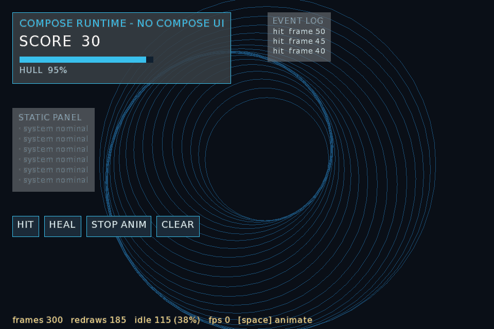

# S6 — Compose runtime on OpenGL, with no Compose UI

Date: 2026-09-09
Verdict: **it works, and the interesting property survives.** A window running this spike sat for
119 frames and redrew **4** times — once at startup and once per button press. Switch an animation
on and it redraws 181 times in 181 frames, then goes quiet again the moment it is switched off.
That is the whole reason to use Compose, and it does not come from Compose UI.



## The question

Everything ComposeGL does today rests on Compose UI, which rests on Skia, which rests on skiko,
which has no published Android or iOS binary (S4). The alternative the owner asked for is to keep
only `androidx.compose.runtime` — the compiler plugin, state, recomposition — and write our own
node tree, layout and renderer underneath it.

The runtime is renderer-agnostic by design: that is how Compose HTML emits DOM and how Mosaic
emits terminal cells. But "it can drive any tree" is not the same as "it still skips work". If the
runtime without Compose UI ends up recomposing every frame, the whole idea is pointless — a game
can redraw an interface every frame without any of this.

So: **does recomposition still buy us "nothing changed, so nothing redraws"?**

## What was built

`spikes/s6-runtime-ui/` — 873 lines of throwaway Kotlin, six files:

| File | Lines | What it is |
|---|---|---|
| `GlNode.kt` | 126 | Our node, our style, and `GlNodeApplier : AbstractApplier<GlNode>` |
| `GlCompose.kt` | 92 | The host: dispatcher, `BroadcastFrameClock`, `Recomposer`, `Composition` |
| `Layout.kt` | 88 | Measure and place: column, row, stack |
| `Widgets.kt` | 100 | `Column`, `Row`, `Text`, `Button`, `Bar` |
| `Renderer.kt` | 118 | One `SpriteBatch`: rectangles from a 1×1 texture, text from a FreeType `BitmapFont` |
| `Main.kt` + `SelfCheck.kt` | 349 | A window with a live HUD, and the same experiment run headless |

The dependency list is the point:

```
androidx.compose.runtime:runtime:1.12.0
org.jetbrains.kotlinx:kotlinx-coroutines-core:1.9.0
com.badlogicgames.gdx:*
```

No skiko. No `compose.ui`. No Material. No `@InternalComposeUiApi` anywhere — every Compose API
this spike touches is public and stable, which is the opposite of `SceneBridge.kt`.

## The measurements

Real OpenGL, real window, Xvfb with Mesa llvmpipe, 300 frames, a script that clicks three buttons
and then switches an animation on:

```
frames=300 redraws=185 idle=115 (38%)
still:     119 frames, 4 redraws
animating: 181 frames, 181 redraws
```

Four redraws in 119 still frames is exactly right: the first composition, plus one per click. The
static panel of six unchanging rows costs nothing at all after the frame it appears.

The same experiment runs headless in milliseconds (`SPIKE_S6_HEADLESS=1`), with a stub for text
measurement and no OpenGL at all — sixteen checks covering composition, state writes, list
insertion and removal, layout geometry, hit testing and click handling. That it runs headless with
no native library is itself part of the answer.

## The one thing that had to be got right

The naive frame pump loses a frame:

```kotlin
drain(); Snapshot.sendApplyNotifications(); clock.sendFrame(nanos); drain()
```

A state write wakes the recomposer, but the recomposer is a coroutine: waking it only *queues* it.
It has not yet reached its `withFrameNanos`, so `sendFrame` goes to nobody, and the change lands
one frame late. Draining between the notification and the frame fixes it:

```kotlin
drain(); Snapshot.sendApplyNotifications(); drain(); clock.sendFrame(nanos); drain()
```

The headless check caught this immediately — "a state write causes exactly one redraw" failed while
"the score row updated in place" passed, which is precisely the signature of a one-frame lag.

Second trap, worth recording because it looked like a runtime bug and was not: driving the clock
with `System.nanoTime()` made the animation update only eight times in 181 frames. A `Float` that
large cannot resolve a sixtieth of a second, so most frames computed the *same* value, and the
runtime correctly refused to redraw. Passing a clock that starts at zero fixed it. The runtime was
right; the spike was wrong.

## What this costs

Honest accounting, because the idle number is the good news and this is the rest:

- **Every Compose UI component goes.** Material 3, `TextField`, `LazyColumn`, `Modifier`,
  animation APIs, focus, accessibility. The Snake demo and the showcase are written entirely
  against them and would be rewritten from nothing.
- **Layout here is a toy.** Column, row, stack, padding, gap. No constraints, no intrinsics, no
  alignment, no subcomposition. Real games need at least alignment and weights.
- **Text input does not exist.** The hardest thing ComposeGL currently gets for free — cursor,
  selection, IME, clipboard — is `TextField`, and `TextField` is Compose UI. Rebuilding it is the
  single largest item in this direction, and it is not small.
- **No vector drawing.** Skia gives paths, gradients, blurs and shadows. `SpriteBatch` gives
  rectangles and glyphs. Anything richer is a shader we write.
- **This is 873 lines that do very little.** A usable widget set is a different order of magnitude.

## What it buys

- Runs anywhere LibGDX runs, which is the actual ask: Android and iOS included, with no native
  library to build or publish. skiko's Linux runtime jar alone is 12 MB; the entire Compose runtime
  is 1.9 MB of pure JVM bytecode.
- No internal APIs, so no breakage on a Compose upgrade.
- Text is already solved by LibGDX FreeType, on every platform LibGDX supports.
- One `SpriteBatch` for the whole interface — no surface upload, no GL state firewall, no
  `DirectContext`.

## Recommendation

The idea is sound and the property that matters survives. This is a real second product rather than
a port of the current one: ComposeGL-on-Skia keeps the whole Compose ecosystem and stays on desktop;
this keeps only the runtime and goes everywhere.

Nothing here should be kept — it is a spike, and the code is labelled as such. The next step, if the
owner wants it, is a proper design for the widget set and text input, because those two are the
project, and the rest of it is the four days already spent.
