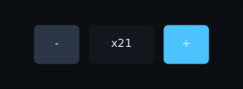

# Input

Four calls in, one answer out.

```kotlin
interface InputSink {
    fun onPointer(event: PointerEvent): Boolean
    fun onKey(event: KeyEvent): Boolean
    fun onText(event: TextEvent): Boolean
    fun onGamepad(event: GamepadEvent): Boolean
}
```

That is the entire contract between your engine and the toolkit. Your backend
translates whatever it has into these; the toolkit answers **did I use that?** so
your game can take whatever is left.

There is no dependency on LibGDX, GLFW, Android or SDL anywhere in it. That is
also why the toolkit tests without a window: a test hands it the same events a
keyboard would.

---

## The interface gets first refusal

```kotlin
override fun onKey(event: KeyEvent): Boolean {
    if (ui.onKey(event)) return true    // a text field ate it
    return world.onKey(event)           // otherwise it is the game's
}
```

Write it that way and a player typing a save-game name does not also strafe.

---

## Wiring it up

Three pieces, each doing one job:

```kotlin
val focus = FocusManager(host.root)
val pointer = PointerRouter(host.root, focus)   // what is under the pointer, and what is a click
val keys = KeyRouter(focus, host.root)          // keys to the focused node, then outwards
val pad = GamepadNavigator(focus, onBack = { back() })
```

Behind one sink:

```kotlin
class GameInput(root: UiNode) : InputSink {
    private val focus = FocusManager(root)
    private val pointer = PointerRouter(root, focus)
    private val keys = KeyRouter(focus, root)
    private val navigate = KeyNavigator(focus, onBack = { back() })
    private val pad = GamepadNavigator(focus, onBack = { back() })

    override fun onPointer(event: PointerEvent) = pointer.onPointer(event)

    // The router first, always: a field that wanted the key has consumed it by the
    // time the navigator is asked. That is the whole of "a field takes the keys it needs".
    override fun onKey(event: KeyEvent) = keys.onKey(event) || navigate.onKey(event)

    override fun onText(event: TextEvent) = keys.onText(event)
    override fun onGamepad(event: GamepadEvent) = pad.onGamepad(event)

    fun frame(timeMillis: Long) {
        focus.refresh()       // focus may have been on a node that no longer exists
        pad.frame(timeMillis) // a held direction repeats
    }
}
```

Then point your engine's translator at it. With LibGDX:

```kotlin
Gdx.input.inputProcessor = InputMultiplexer(
    GdxPointerInput(input, { viewport }),
    GdxKeyboardInput(input),
)
GdxGamepadInput(input).start()
```

Call `input.frame(...)` once a frame, after layout — focus is worked out from where
things actually are.

---

## Focus

Focus is the cursor for anybody without a cursor. It moves by geometry: press down
and the nearest focusable thing below takes it.

```kotlin
Button("LAUNCH", onClick = { }, initialFocus = true)

Modifier.focusable()
Modifier.focusRequester(callsign)     // …and focus.focusOn(callsign) to send it there
Modifier.focusOrder(down = mapTab)    // override the geometry where it guesses wrong
Modifier.focusTrap()                  // a dialogue keeps focus inside itself
Modifier.onReveal { child -> scrollTo(child) }
```

`focus.refresh()` once a frame is what stops a menu ending up open with nothing
selected: when the node that had focus disappears, something real takes it. It
has to run after the layout, so `UiRenderer` will do it for you — `ui.focus =
focus` — and outside a renderer, `host.settle(viewport, focus, nanos)` is the
same three calls in the same order. Keep calling `refresh` yourself if your game
has two trees and two managers: the renderer only knows about one.

When a whole screen's layout is the exception — not one node, which `focusOrder`
already covers — `focus.focusSearch` swaps out the scoring itself. Subclass
`BeamFocusSearch` and override `accepts` (what counts as being in the direction
pressed) or `beats` (which of two candidates wins).

```kotlin
focus.focusSearch = object : BeamFocusSearch() {
    override fun accepts(direction: FocusDirection, source: Rect, dest: Rect) =
        super.accepts(direction, source, dest) ||
            (direction == FocusDirection.Down && dest.centre.y > source.centre.y)
}
```

---

## Sounds

The toolkit never plays audio, but it knows when something happened. Hand it your
sounds once, round the whole screen:

```kotlin
ProvideUiSounds(object : UiSounds {
    override fun hover() = audio.play("tick")        // the mouse came onto a control
    override fun press() = audio.play("click")       // a control went down: mouse, Enter, Space or South
    override fun focusMove() = audio.play("move")    // arrows, Tab, d-pad or stick stepped focus
    override fun change() = audio.play("toggle")     // a checkbox, switch, radio button or slider changed
}) {
    MainMenu()
}
```

Every method does nothing unless you override it, so name only the sounds you have.

No widget has sound code in it. The pointer router hears every hover and press and
the focus manager hears every step, so a control you build yourself out of
`clickable` and `focusable` ticks exactly like a `Button`. The rules:

- **Only usable things sound**: enabled and `clickable`, or enabled and `focusable`.
  A disabled button is silent, and so is a panel that only watches the pointer.
- **One hover per arrival.** Moving inside a button is silent; moving onto a button
  inside a clickable card ticks once, for the button.
- **Press on the way down**, as a real button clicks. Dragging off and back on does
  not press again, and letting go does not hover again — unless you let go over a
  different button, which ticks for that one.
- **Focus moves the player asked for.** A click focusing what it clicked, the first
  frame's auto-focus and a dialogue handing focus back are all silent. So is Left on
  a slider, which is a change, not a move.
- **A slider** changes once per step as its knob lands, and a continuous one plays a
  single change when it is let go, not a buzz every frame.

`ProvideUiSounds` nests: the pause menu and the HUD behind it can sound different.
A control of your own that changes a value reports it the same way the stock ones do:

```kotlin
val sounds = LocalUiSounds.current
Box(Modifier.focusable().clickable { sounds.change(); level++ })
```

---

## Which device is the player using?

```kotlin
val source = InputSourceTracker()
val sink = SourceAware(source, toolkit)   // wraps; the answers underneath are unchanged
```

Then:

```kotlin
source.current          // Mouse, Touch, Keyboard or Gamepad
source.isPointing       // there is a cursor to draw
source.showsFocusRing   // there is not, so draw the ring instead
```

A focus ring drawn while somebody is using a mouse is a second highlight fighting
the hover, which is why interfaces that draw it unconditionally look wrong on a
desktop. This is the answer to that, and it changes the moment somebody picks up a
pad.

It is also what `PromptGlyph` reads:

```kotlin
PromptGlyph(Action.Interact)       // E … or Ⓐ … or ✕
```

`Action` is a value class over a string, so your own actions cost nothing:

```kotlin
val Vent = Action("vent")
prompts.bind(Vent, PromptStyle.Xbox, Prompt(key = "pad.west", label = "X"))
```

A skin with a button atlas names its regions after those keys and gets real
buttons; a skin with none gets the label in a box, which is readable everywhere
and wrong nowhere.

---

## Haptics

A small bump back from a control makes it feel physical. Ask for one by what
happened, not by how a motor should move:

```kotlin
LocalHaptics.current.perform(Haptic.Failure)   // not enough gold
```

`LightTap`, `MediumTap`, `HeavyTap`, `Tick`, `Success`, `Warning`, `Failure`.
Buttons, tick boxes, switches and radio buttons already give a `LightTap` when
clicked, and a slider gives a `Tick` for each notch it moves. Anything else is
yours to ask for.

Provide the platform's, the same way as the clipboard:

| where | what | plays |
|---|---|---|
| Android | `AndroidHaptics(view)` | the phone's own tap, confirm and reject effects. No permission needed |
| iPhone | `UiKitHaptics()` | UIKit's impact, selection and notification generators |
| LibGDX, anywhere | `GdxHaptics(source = source)` | a touch buzzes the phone; a pad rumbles the pad; a mouse or keyboard moves nothing |
| LWJGL3, headless | nothing | `Haptics.None`. GLFW has no rumble |

```kotlin
val haptics = GdxHaptics(source = source)     // the same tracker the input goes through
ProvideHaptics(haptics) { Hud() }
```

Pass the tracker. Without it `GdxHaptics` cannot tell what is in the player's
hand, so it asks both motors, and a mouse click hums the pad lying on the desk.

Nothing reports whether anything moved. A phone with vibration switched off
answers the same as one that buzzed, and that is the player's choice.

In a test, `HeadlessBackend` records every request:

```kotlin
val felt = RecordingHaptics()
uiTest(backend = HeadlessBackend(haptics = felt)) { Shop() }.use { ui ->
    ui.click("buy")
    assertEquals(listOf(Haptic.LightTap, Haptic.Failure), felt.performed)
}
```

---

## Back

Escape, the pad's B button and Android's back gesture are the same question: *what
is open?*

```kotlin
ProvideBackStack(backs) {
    Screen()
}

// anywhere inside
OnBack(enabled = inventoryOpen) { inventoryOpen = false }
```

The innermost one wins: the stack asks the most recently added handler first, and
the most recently added is whatever opened last. `Dialog` puts itself on the stack,
so Escape and B close it without you wiring anything.

Ask the stack first and let the screen handle what nothing wanted:

```kotlin
GamepadNavigator(focus, onBack = { if (!backs.back()) state.back() })
```

---

## Long press, double click, hold to repeat

```kotlin
Slot(Modifier.clickable(
    onDoubleClick = { equip(item) },       // open a save, equip an item
    onLongPress = { showActions(item) },   // context actions, hold to confirm
) { select(item) })

Box(Modifier.repeatingClickable(initialDelayMillis = 400, intervalMillis = 60) { count++ }) {
    Text("+")
}
```

Think of a doorbell. A tap rings once. Holding it down is a different message. Two
quick taps is a third.

- **Double click.** The first click fires `onClick` straight away. A second press
  within 300ms fires `onDoubleClick` *instead of* a second `onClick`. So "select,
  then equip" needs no waiting. A third click is a plain click again.
- **Long press.** Held for 500ms, `onLongPress` fires once, while still held. The
  release after it is not a click. Sliding off first cancels it, even if you slide
  back.
- **Hold to repeat.** A tap is one step, on release. Held, it steps after
  `initialDelayMillis`, then every `intervalMillis`, until you let go. Sliding off
  pauses it. A long stall steps once, not in a burst.

All three work the same from a mouse, a finger, Enter, or the pad's South button.
Enter's own key repeat is ignored, so the two don't add up. Moving focus away while
holding Enter counts as sliding off.

Timings run on a `Clock` (`Clock.Ui` unless you pass `clock =`), advanced by the
host each frame. Put a world panel's buttons on `Clock.World` and a hold pauses with
the game. It also means a test runs a two-second hold by advancing frames.

A `clickable` with no `onDoubleClick` or `onLongPress` is timed by nothing, so a
held plain button still costs no frames.



---

## Dragging

A window by its frame, a map being panned, an item picked up out of a slot:

```kotlin
var at by remember { mutableStateOf(Offset.Zero) }

Panel(
    Modifier
        .offset(at.x, at.y)
        .draggable(
            onDragStart = { grabbedAt -> },
            onDragEnd = { snapToSlot() },
            onDragCancel = { at = home },   // defaults to onDragEnd
        ) { delta -> at += delta },
) { … }
```


Every hand-written drag gets one of these slightly wrong, so `draggable` does them once:

- **Slop.** Nothing happens until the pointer is more than 8 units from the press
  (`slop =` to change it). Then `onDragStart` gets where the press was, and the first
  `onDrag` carries the whole way from there, so the item is never behind the pointer.
  A press that stays inside the slop is still a click.
- **Capture.** The drag carries on outside the widget and outside the window. A drag
  is never a click, wherever it is let go.
- **A widget that moves.** A window following the pointer moves exactly as far as
  the pointer does. Deltas are in the widget's own units, so a half-size map pans at
  the speed it looks like it should.
- **Cancel.** The platform taking the gesture away calls `onDragCancel`, never
  `onDragEnd`, so the item can go home instead of being dropped.
- **Things inside.** A button in a draggable window is clicked by a steady press.
  Drag from it instead and the button lets go — no click — and the window moves. A
  slider in the window keeps its own drags: it is using the pointer, so it keeps it.
- **Holds.** A press that becomes a drag is no longer a hold. A long press or a
  `repeatingClickable` under it never fires, however long the drag lasts.

It is the primary button or a finger. Two fingers drag two things at once. A disabled
`draggable` does not take the press at all, and turning one off mid-drag cancels it.

---

## Raw events

When a widget needs more than a click or a drag:

```kotlin
Modifier.onPointer { event ->
    when (event) {
        is PointerEvent.Press -> { drag.start(event.position); true }
        is PointerEvent.Move -> { drag.to(event.position); true }
        is PointerEvent.Release -> { drag.finish(); true }
        is PointerEvent.Cancel -> { drag.abandon(); true }
        else -> false
    }
}
```

`Cancel` is the one people forget. The window lost focus, the platform started a
system gesture, a finger lifted outside the screen — whatever had the pointer must
let go **without** firing a click. Handle it and a dragged slider does not stick.

## Widgets that are not rectangles

A click finds a widget by its rectangle. For a round button, a diamond or a honeycomb
cell that is too generous: the empty corner of one rectangle sits over the middle of
its neighbour, so the click goes to whichever happened to be drawn last, and the widget
the player can plainly see they aimed at loses.

```kotlin
val round = remember(radius) {
    { p: Offset ->
        val dx = p.x - radius
        val dy = p.y - radius
        dx * dx + dy * dy <= radius * radius
    }
}
Modifier.hitShape(round)
```

`remember` because a shape written inline is a new lambda every recomposition, and a
modifier chain that never compares equal makes the widget re-resolve and redraw every
frame. The same caveat applies to `clickable` and `drawBehind`.

The rectangle is still asked first and the shape only ever narrows it. Say no and the
click carries on to whatever is underneath, which is the point — in a honeycomb the
pointer falls through the corner it was handed to the cell that really owns it. Hover
asks the same question, so a panel is hovered only where it would have been clicked.

`p` arrives in the widget's own coordinates — the same ones `onPointer` gives you, with
any `scale` divided back out, so the shape survives the widget growing. It speaks for
its own widget only; a child that wants the same shape asks for it itself.

## The cursor's shape

An I-beam over somewhere to type, a hand over a link, an arrow over an edge that drags:

```kotlin
Modifier.pointerHoverIcon(PointerIcon.Hand)
```

The router shows the icon of the topmost thing under the mouse. Something that asks for
nothing shows its nearest ancestor's, so an icon on a panel covers every button inside
it — and something drawn on top of the panel hides it, the same way it would take the
click. `TextField` asks for `PointerIcon.Text` already; put your own on its modifier and
yours wins.

Hand the router the backend's cursor and it keeps the shape right:

```kotlin
val pointer = PointerRouter(host.root, focus, backend.cursor)
```

| icon | |
|---|---|
| `Default` | the arrow |
| `Text` | an I-beam |
| `Hand` | a pointing hand |
| `Crosshair` | a thin cross |
| `ResizeHorizontal`, `ResizeVertical` | two-way arrows |
| `ResizeTopLeftBottomRight`, `ResizeTopRightBottomLeft` | the corners |
| `Move` | four-way arrows |
| `NotAllowed` | a circle with a line through it |

The rules, all of them things you would otherwise find out by accident:

- **A drag keeps its shape.** While a press is held the icon stays whatever it was when
  the press began, so a resize arrow does not flick back to the arrow when a fast drag
  outruns its edge.
- **An icon takes no clicks.** It makes a node findable, not pressable: a crosshair laid
  over a map still lets the press through to the map.
- **Only a mouse or a stylus changes it.** A finger has no cursor and a ray in the world
  is not the one on the desktop.
- **The backend is asked when the shape changes**, never per mouse move.
- **The shape is read when the mouse moves.** A field switched off under a still mouse
  keeps its I-beam until the mouse next twitches.

`pointer.pointerIcon` says what the shape should be, for a game that draws its own
cursor. `GdxBackend` and `Lwjgl3Backend` change the real one; on Android and iOS there
is nothing to change and the call does nothing. A backend that cannot show a shape
shows the arrow.

---

## Text

```kotlin
Modifier.onTextEvent { event -> buffer.insert(event.text); true }
```

Text is separate from keys on purpose: a key is a physical button, and text is what
the platform decided those buttons meant — which depends on layout, modifiers and
the input method. `TextField` already does all of this.

### Japanese, Chinese and Korean

Those languages are not typed one key at a time. You type `ni`, the input method
holds it as **provisional** text — shown underlined, not decided yet — and offers
you `に`, `二`, `荷` to choose from. A phone's autocorrect is the same machinery:
the keyboard keeps a word open and commits something other than what you pressed.

A stream of characters cannot express that, because both go back and edit text they
already sent. So a backend can drive a field directly instead:

```kotlin
// desktop
ProvideTextInput(GlfwTextInput(window)) { Hud() }

// Android
ProvideTextInput(AndroidTextInput(activity) { Gdx.app.postRunnable(it) }) { Hud() }
```

Pass nothing and you get `TextInput.None`, which is key events alone — correct for
any language you can type one key at a time, and what everything did before this
existed.

---

## What next

- **[[Widgets]]** — `TextField`, `Slider`, `Hotbar` and what they do with input
- **[[Backends]]** — the translators that ship, and writing your own
- **[[Testing]]** — handing the toolkit events with no window anywhere
