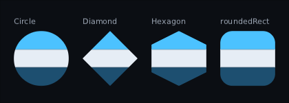

# Modifiers

`Modifier` is the same idea as Compose's: a chain of things said about a widget,
folded left to right, read by layout and by drawing.

```kotlin
Panel(Modifier.align(Alignment.BottomStart).padding(20f).width(280f)) { … }
```

If you know `Modifier.padding(8f).background(Color.Blue)`, you know this. What
follows is the list, and the three rules that are ours.

---

## The list

**Size**

```kotlin
Modifier.size(64f)                 // square
Modifier.size(width = 200f, height = 40f)
Modifier.width(280f)
Modifier.height(40f)
Modifier.fillMaxWidth()            // all of what the parent offers
Modifier.fillMaxHeight(0.5f)       // half of it
Modifier.fillMaxSize()
Modifier.fillMaxWidth().aspectRatio(3f / 4f)  // as wide as the slot, height follows at 3:4
Modifier.widthIn(min = 200f, max = 400f)   // as wide as the contents, inside that range
Modifier.heightIn(min = 40f)
Modifier.sizeIn(minWidth = 64f, minHeight = 64f)
Modifier.defaultMinSize(minWidth = 48f)    // only when nothing else says a width
```

A range is a rule rather than a wish, so it holds wherever it sits in the chain:
`width` and `fillMaxWidth` are measured inside it. See [[Layout]] for the details.

**Space**

```kotlin
Modifier.padding(12f)
Modifier.padding(horizontal = 16f, vertical = 8f)
Modifier.padding(left = 28f, bottom = 28f)
Modifier.offset(x = 0f, y = 2f)    // move it, without moving anything else
Modifier.parallax(pointer, factor = -0.02f) // …by how far the pointer is from the middle
```

**Parallax is cheap depth.** Each layer is offset by a *factor* times how far a
*source* has moved from rest — the far layer at a small factor, the near one at a
bigger one:

```kotlin
val pointer = remember { PointerParallax(centre = Offset(640f, 360f)) }
val stick = remember { StickParallax(reach = Offset(640f, 360f)) }
val sink = ParallaxAware(toolkitSink, pointer = pointer, stick = stick)  // hand this to the backend

Image(sky, Modifier.parallax(pointer, factor = -0.02f).parallax(stick, factor = -0.02f))
Image(hills, Modifier.parallax(pointer, factor = -0.06f).parallax(stick, factor = -0.06f))
```


Three sources come with it:

- `PointerParallax(centre)` — how far the pointer is from `centre`. Back to rest when
  the mouse leaves the window or a finger lifts.
- `StickParallax(reach)` — the right stick by default, since the left one is moving
  focus. Full tilt is worth `reach`, so the same factor means the same thing for a
  stick as for a mouse. Back to rest when the pad is unplugged.
- `ScrollParallax(scrollState)` — how far a `ScrollArea`'s rows have moved. Factor
  one travels with the rows; a half travels at half their speed.

`ParallaxAware` wraps the sink a backend pushes into so the sources see every event,
including the ones a button uses; the answers are the sink's, unchanged. Anything
else that moves can be a source too: implement `ParallaxSource` with a
state-backed `position`.

It is an `offset` and nothing more, so layout does not move — neighbours keep their
places — while clicks move with the picture. A positive factor follows the source;
a negative one leans away from it. Two on one widget add up. The source is read while
composing, so each move recomposes the composable that wrote the modifier: keep the
layers in a small composable of their own. A still source costs nothing. Give a layer
that fills the screen a margin, or `clip` its parent, or its edge shows as it drifts.

**Where it goes**

```kotlin
Modifier.align(Alignment.TopEnd)   // inside a Box
Modifier.weight(1f)                // inside a Row or Column
Modifier.zIndex(1f)                // drawn over its siblings, and clicked first
Modifier.layoutId("icon")          // inside a layout of your own; see [[Custom layouts]]
```

**zIndex is for lifting one thing out of a pile.** Siblings paint in the order
they are written. A selected card, a dragged tile, a hovered item can come forward
without being moved in the code — which would also move it in focus order and
change what recomposition matches it by:

```kotlin
Card(Modifier.zIndex(if (selected) 1f else 0f))
```

Higher is drawn later, so on top. Equal values keep source order, so the default of
zero changes nothing, and a negative value sinks a node under its siblings. Clicks
and hover follow the picture: where two cards overlap, the one on top gets the
press. Layout and focus do not — a row still lays out left to right as written, and
Tab still walks in source order. It orders siblings only: a child with a huge
zIndex inside a low parent stays under that parent's higher siblings. Two on one
node add, like `offset`.


**How it looks**

```kotlin
Modifier.background(Colour.rgb(0x1A1F28), corner = 6f)
Modifier.border(Colour.rgb(0x2C3545), width = 1f, corner = 6f)
Modifier.shadow(Colour.argb(0x80000000), spread = 12f, corner = 6f)
Modifier.ninePatch(frame)          // skin art, stretched properly
Modifier.background(Accent, Corners.top(8f))  // …with a radius per corner
Modifier.clip()                    // children cannot draw outside
Modifier.clip(corner = 6f)         // …with rounded corners
Modifier.clipShape(Shapes.Circle)  // …or any convex shape: a round portrait
Modifier.alpha(0.4f)               // the subtree fades as one thing
Modifier.scale(1.2f)               // …drawn bigger, without re-laying it out
Modifier.mirror()                  // …flipped to face the other way
Modifier.effect(blur(radius = 8f)) // …through a shader
```

**Clipping to a shape.** `clip()` is a rectangle, and free. `clipShape` cuts to any
convex shape instead — a round portrait, a diamond minimap, a hexagon tile — from
square art, at draw time:



```kotlin
Image(portrait, Modifier.size(64f).clipShape(Shapes.Circle))
Box(Modifier.size(96f).clipShape(Shapes.Diamond)) { Minimap() }
Box(Modifier.clipShape(Shapes.polygon(0.5f, 0f, 1f, 1f, 0f, 1f))) { … }  // fractions of the box
```

The shapes are `Shapes.Rectangle`, `Circle`, `Ellipse`, `Diamond`, `Hexagon`,
`roundedRect(corner)` and `polygon(…)`. A polygon's points are fractions of the
widget's box, so one shape fits every size; a concave one throws, because only a
convex outline can be drawn in one piece.

Chain order decides what is cut. What the chain paints *after* `clipShape` is cut
with the content and children; what it paints *before* stays whole:

```kotlin
Modifier.border(ring, 2f).clipShape(Shapes.Circle).background(grey)  // square ring, round disc
```

What the shape cuts away cannot be clicked either — the click goes to whatever is
drawn there instead. The same shape goes to `hitShape` to make the widget itself
round to the pointer without cutting anything:

```kotlin
Modifier.hitShape(Shapes.Circle)
```

A shaped clip draws the widget into an offscreen picture and puts it back through the
shape, with an edge softened over one screen pixel. That is one picture per clipped
widget per frame: fine for portraits and a row of tiles, not for a thousand. A canvas
that cannot make or cut pictures clips to the rectangle instead.

**Scale is for arriving and for fitting.** The widget and everything under it are
drawn into an offscreen picture at the size layout gave them, and that picture is
put down bigger or smaller:

```kotlin
Panel(Modifier.scale(spring.value)) { … }                  // a panel springing in
Panel(Modifier.scale(min(1f, budget / measured))) { … }     // one squeezed to fit
Panel(Modifier.scale(1.4f, Alignment.TopStart)) { … }       // grown from a corner
```

Layout does not move, so a panel arriving does not shove its neighbours and a fit
correction does not re-flow what is inside it. Clicks and pad focus *do* move:
`boundsInRoot` reports where the widget is drawn, so a button drawn at twice the
size is clickable at twice the size. `layoutBoundsInRoot` is the rectangle before
any scaling, for the code that wants the slot rather than the pixels. And
`paintedInRoot` is a third question again — what the subtree actually *painted*,
scaling folded in, which for text is the glyphs rather than the line box and for a
bare `Box` used only for layout is nothing at all:

```kotlin
val ink = node.paintedInRoot          // null: it drew nothing, or has not been laid out
```

Reach for it when something has to frame composed content — a debug overlay, a
focus ring that should hug the letters, a screenshot cropper, a containment
assertion in a test. Using the node box for any of those over-reports by roughly
the leading plus the descent: small enough to look like a rounding bug, big enough
to fail a strict check.

A few things to know. It magnifies a picture, so past about 1.15 it is visibly
soft and text is soft sooner — a world that wants to be crisp at three times the
size wants to be *laid out* three times the size. The capture is the widget's own
rectangle, so anything a child draws outside it is cut off while the scale is on —
and clicks agree, so what you cannot see you cannot press. The other direction is
not true: the picture is put down filling the *scaled* rectangle, so `clip()` on the
same widget does not hold it in. A viewport that must not spill wants the `clip` on
the parent and the `scale` on the child inside it.

A canvas can refuse to make the picture at all, and the two backends here refuse one
bigger than 4096 screen pixels a side. Then the subtree is drawn plainly, at its
ordinary size, and hit testing goes back with it. Ask `canvas.drawsLayers` first if a
screen would rather pick a different animation.

Two scales on one widget multiply, so an arrival animation and a fit correction
compose. A scale of one takes no picture at all. Zero draws nothing and cannot be
clicked or focused, which is what lets a panel arrive from nothing. A negative factor
throws rather than mirroring — flipping is `mirror()`, below — so hand an anticipate
easing over as `scale(t.coerceAtLeast(0f))`.

**Mirror is for one piece of art facing either way.** The same offscreen picture,
put down read from the other side, flipped in place about the widget's middle:

```kotlin
Portrait(Modifier.mirror(horizontal = speaker.isOnRight))   // a speaker on either side
Arrow(Modifier.mirror(vertical = pointsDown))               // one arrow, up or down
```


**Text inside flips too**, and reads backwards — nothing inside knows it is being
mirrored. Mirror the art, and put the name label beside it rather than inside it.

Layout does not move. What is inside does, and clicks, pad focus and `boundsInRoot`
move with it: in a mirrored row the first child is drawn on the right, clicked on the
right, and is where focus goes when the player presses right. A pointer handler
inside gets its own coordinates mirrored too, so a drag to the right on screen is a
drag to the left to it — which is what keeps a mirrored slider under the finger. The
same goes for the arrows and the pad a focused widget claims: pressing right on a
mirrored slider moves its knob right on screen, which is towards its own minimum.

Two mirrors cancel, so a flipped portrait inside a flipped panel faces the way it was
drawn. `mirror(horizontal = false)` takes no picture, so the flag can come straight
from game state. It shares a picture with a `scale` on the same widget, and is
flipped first and then turned under a `rotate`. The rest is scale's bargain: the
capture is a clip, and a canvas that cannot flip a picture (`canvas.mirrorsLayers`)
draws the widget the right way round and is clicked the right way round.

**Shake**

```kotlin
val shake = rememberShake()
Panel(Modifier.shake(shake)) { … }
shake.trigger()                     // wrong password: it jolts and settles on its own
shake.trigger(intensity = 0.3f)     // a lighter knock
```


A shake is **trauma**, the way game cameras do it. Each knock adds to `trauma`, which
stops at one and drains by itself (`decayPerSecond`, 1.5 by default, so a full knock is
still in about two thirds of a second). The widget is moved by trauma *squared* times a
smooth noise, up to `maxOffset` each way — so half a knock is a quarter of the movement,
and a big shake eases out instead of stopping dead. Mashing a locked door cannot shake
the panel off the screen, because full is full.

It is an `offset`, so layout does not move: the neighbours stay put and the parent does
not grow. Clicks move with it, as they do with any offset. Put `shake` before
`background` to move the whole widget, or after it to rattle the contents inside a frame
that stays still.

It runs on a clock. The default is `Clock.Ui`, which keeps going under a pause menu; a hit
on the player belongs to `Clock.World` and freezes with the game:

```kotlin
val hurt = rememberShake(clock = Clock.World, maxOffset = 6f)
```

The wobble comes from the time and a `seed`, not from randomness, so a shake is the same
every run and a test can say exactly where the widget was. Give two widgets shaking side
by side different seeds, or they move in step. A still shake costs no frames; `stop()`
puts it straight back.

**Your own drawing**

```kotlin
Modifier.drawBehind { bounds -> rect(bounds, Colour.rgb(0xE5484D)) }
Modifier.drawInFront { bounds -> border(bounds, Colour.White, 1f) }
```

The receiver is a [`UiCanvas`](https://github.com/wildware-uk/composegl/blob/master/composegl-ui/src/commonMain/kotlin/dev/wildware/composegl/ui/graphics/UiCanvas.kt)
and the argument is the widget's rectangle in screen coordinates.

**Turning a picture, and making it glow.** Two things the canvas can do that a
plain rectangle cannot:

```kotlin
Modifier.drawBehind { bounds ->
    // A sunburst: one picture per ray, each turned about the hub on the left edge.
    pushBlend(BlendMode.Additive)        // light adds; paint covers
    repeat(14) { ray ->
        image(spark, bounds, degrees = ray * 360f / 14f, pivotX = 0f)
    }
    popBlend()
}
```

`degrees` turns clockwise, because y grows downwards here. `destination` is the box
*before* turning, so the pixels can land outside it. The rays batch together — no
draw call per ray — but a blend mode is a batch boundary, so push it round the whole
group rather than per call: a dozen quads between one push and one pop cost two
boundaries, not twenty-four.

Both degrade honestly on a backend that cannot do them: the picture is drawn upright
and the glow is drawn as ordinary paint. Ask `canvas.rotatesImages` and
`canvas.supports(BlendMode.Additive)` first if you would rather draw something else.

**A note on colours.** `Colour.rgb(0x…)` and `Colour.argb(0x…)` are how you write
one. There are also about a dozen named ones — `Colour.Red`, `Colour.Grey`,
`Colour.Orange` — for a debug box, an example, or a prototype nobody has skinned
yet. They are deliberately plain and deliberately few: your game's actual colours
belong in its **[[Skins|skin]]**, where one edit changes every panel at once.

**Input**

```kotlin
Modifier.clickable { fire() }
Modifier.clickable(enabled = false) { }   // still swallows the click
Modifier.clickable(onDoubleClick = { equip() }, onLongPress = { actions() }) { select() }
Modifier.repeatingClickable { count++ }   // the + on a quantity picker
Modifier.interaction(state)               // hover and press, for drawing
Modifier.draggable { delta -> at += delta } // slop, capture and cancel done for you
Modifier.onPointer(handler)               // raw pointer events
Modifier.onKeyEvent(handler)
Modifier.onTextEvent(handler)
Modifier.hitShape { it.x >= 20f }         // which points inside the box are really yours
Modifier.pointerHoverIcon(PointerIcon.Hand) // the mouse cursor's shape over it
```

**A note on `hitShape`.** Hit testing is rectangles, because nearly everything is a
rectangle and rectangles are cheap. A round button, a diamond or a honeycomb cell is
not, and its rectangle overlaps its neighbours' — so the empty corner of one sits over
the middle of another and the click goes to whichever was drawn later. `hitShape` is
how a widget says those corners are not its own; saying no lets the click carry on to
whatever is underneath.

The question is asked in the widget's own coordinates, the ones `onPointer` delivers,
with any `scale` already divided back out — so the shape is written once against the
widget's own width and height and keeps working while it grows. Unlike `clip` it gates
that one widget and says nothing about its children: it does not change what is drawn,
so it must not change what is reachable. A child that wants the same shape asks for it
itself. Two on one widget is a choice rather than a quantity, so the later one wins.

**Focus**

```kotlin
Modifier.focusable()
Modifier.focusRequester(requester)        // send focus straight here
Modifier.focusOrder(down = inventoryTab)  // override the geometry
Modifier.focusTrap()                      // a dialogue keeps focus inside itself
Modifier.onFocusWithin { inside -> … }
Modifier.onReveal { child -> scrollTo(child) }
```

Focus has its own page: [[Input]].

**Testing**

```kotlin
Modifier.testTag("play")                  // host.root.find("play") from a test
```

Changes nothing about how the node looks or behaves. See [[Testing]].

**Being told where it ended up**

```kotlin
Modifier.onPlaced { node -> anchor = node.boundsInRoot }   // it moved on screen
Modifier.onSizeChanged { size -> emitter.resize(size) }    // it got bigger or smaller
```

A popup under a button, a particle emitter the size of a panel, a tutorial arrow
pointing at something: all of them need to know where a widget is, and none of
them should ask every frame.

Both are called after layout has finished, so every rectangle in the tree is this
frame's, parents first. Both are called only when the answer changed — the first
layout counts — so a still screen calls nothing. `onPlaced` is about where the
widget is *drawn*: a parent moving it or scaling it counts, even though the widget
itself did not change. `onSizeChanged` is only its size, so moving is not resizing.

`onPlaced` hands you the node rather than a rectangle, because you usually want one
of three: `boundsInRoot` for the pixels, `layoutBoundsInRoot` for the slot, or
`paintedInRoot` for the ink. Read what you need during the call; do not keep the node.

State written in either lands on the next frame, the same as in Compose:


Rule 2 below applies: `remember` the handler on a widget that recomposes often.

---

The decoration ones, on the same box:


**One radius, or one per corner.** `background`, `border` and `shadow` take a single
`corner`, or a `Corners` with a radius for each — clockwise from the top-left, like
CSS. That is how a tab rounds only along its top, a speech bubble keeps one sharp
corner, and a panel docked to the edge of the screen stays square against it:

```kotlin
val speech = Corners(topLeft = 14f, topRight = 14f, bottomRight = 14f, bottomLeft = 0f)

Modifier.background(Accent, Corners.top(8f))                       // a tab
Modifier.shadow(Glow, spread = 10f, corners = speech)
    .background(Steel, speech)
    .border(Accent, width = 2f, corners = speech)                  // a bubble
Modifier.background(Steel, Corners.left(16f))                      // docked to the right edge
```

Give the border and the shadow the same `Corners` as the background, or they show
at the corner that differs. `Corners.top`, `bottom`, `left` and `right` round two;
`Corners.all(r)` is exactly `corner = r`. A backend that cannot round corners one by
one draws every corner at the smallest of the four and says so through
`canvas.roundsCornersSeparately`; both backends here can. `clip(corners)` rounds
a clip the same way, through `clipShape` (see *Clipping to a shape* above).


And what `padding` does to what is inside it:


---

## Rule 1: order matters, and it is visible

```kotlin
Modifier.padding(8f).background(blue)   // blue is painted inside the padding
Modifier.background(blue).padding(8f)   // blue is painted across the whole widget
```

Both are useful and the difference is on the screen, which is why the chain stays
in order rather than being collected into a bag of properties.

The same applies to two backgrounds, a background and a border, or a nine-patch
and padding — each one paints where it sits in the chain.

---

## Rule 2: equality is what makes a still screen free

A node's modifier is compared on every recomposition to decide whether anything
changed. Every element is a data class, so the chain compares by value, and a
screen that has not changed costs nothing.

The one thing that defeats that is a lambda written inline:

```kotlin
Modifier.drawBehind { … }        // ❌ a new object every recomposition
```

Same trap as Compose, same fix:

```kotlin
val glow = remember { drawGlow() }
Modifier.drawBehind(glow)        // ✅ compares equal
```

It only matters on a widget that recomposes often. `clickable { }` on a menu
button is fine.

---

## Rule 3: `styled` is how a widget gets its look

```kotlin
Box(Modifier.styled(style)) { … }
```

One call, because the three parts have to happen in order: the background paints
across the widget, the padding keeps its contents off the edge, and the content
offset moves those contents without moving the background — which is how a pressed
button's label shifts down a pixel while its frame stays put.

A widget that writes `styled(style)` and then draws its text in `style.textColour`
contains no colour, no corner radius and no texture name of its own. That is what
makes one skin file change the look of a whole game. See [[Skins]].

---

## Writing your own

A modifier is an element plus an extension function:

```kotlin
data class GlowElement(val amount: Float) : Modifier.Element

fun Modifier.glow(amount: Float) = then(GlowElement(amount))
```

A data class, so the chain still compares by value. Then read it wherever it is
meant to act — a measure policy, a draw pass, your own widget. The built-in ones
are read by `ResolvedModifier`, which folds the chain once per node per frame.

---

## What next

- **[[Layout]]** — size, weight, arrangement, alignment
- **[[Skins]]** — where `styled` gets its style from
- **[[Input]]** — clickable, focus, and what the handlers see
- **[[Shaders]]** — what `effect` can be given
