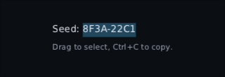

# Widgets

Everything that ships. Two sets: the ordinary interface controls, and a tier of
things only games need.

None of it is Material. There is no theme to fight, and every widget takes its
look from a [[Skins|skin]] file rather than from code.

---

## Text

```kotlin
Text("HULL INTEGRITY")
Text("148", colour = Colour.rgb(0xE5484D))
Text(story, softWrap = true, maxLines = 3, ellipsis = "…")
Text(name, Modifier.weight(1f), align = HorizontalAlignment.End)
Text(trackName, Modifier.width(160f).marquee())   // too long? it scrolls round
```

A name too long for a fixed slot can scroll instead of wrapping or ellipsising: see
**Marquee** in [[Modifiers]].

What was measured is what is drawn — the layout object the font produced at
measure time is the object handed to the canvas, so text never wraps differently
from the space reserved for it.

`style` picks a named style from the skin (`"label"` by default):

```kotlin
Text("GAME OVER", style = "display")
```


### Where the text sits

A text node is placed by its **line box**, whose top is the tallest glyph's
ascent. That is right for laying out — a box stopping at the capitals would clip
the accent off `Á` — but it is not what most coordinates mean. If you are
porting a layout from an immediate-mode or batch renderer, every y you carry
across is a **cap top**, and handed straight to `Text` every figure draws
`ascent - capHeight` low:

```kotlin
Text("148", Modifier.offset(y = capTop), anchor = TextAnchor.CapTop)
Text("HP", Modifier.offset(y = baseline), anchor = TextAnchor.Baseline)
```

Worth doing rather than subtracting yourself, because the mistake is **silent** —
nothing clips and nothing overflows, the text is just low and looks deliberate —
and it is **proportional to the font size**, so a screen with three text sizes is
wrong by three different amounts and reads as three separate layout problems.

The anchor moves the node, not the glyphs inside it: same size, same wrapping,
and the background, border and clicks move with it. Your own `offset` still adds
on top. If you only want the number, `FontMetrics.capInset` is the line box top
to cap top, and `ascent` is the baseline.

`TextAnchor.Baseline` is also how you line a label up with an icon, or two
strings at different sizes against each other.

### Styled runs: an underlined term, a struck word, a value in colour

A `Text` draws one string in one style. When part of a sentence has to look
different — a term the reader can tap for an explanation, a word struck through
because it no longer applies, a number in another colour — say which characters:

```kotlin
val term = TextRange(4, 12)
Text(
    "The tincture wears off at dawn.",
    runs = listOf(
        TextRun(term, colour = Colour.Orange, decoration = TextDecoration.Underline, tag = "tincture"),
    ),
    onRunHover = { highlight(it?.tag) },
    onRunClick = { explain(it.tag as String) },
)
```

A `TextRun` is a range, a colour, a decoration (`Underline` or `Strike`) and a
`tag` of your own that comes back when the pointer is over it. Runs may overlap;
the later one wins for whichever of colour and decoration it names. A run cannot
change the family or the size, on purpose: a run that changes the size changes
the line height, and a paragraph whose lines are different heights is a much
bigger problem than an underlined term.

That is the whole of what you write. **The toolkit keeps ownership of measuring
and line breaking**, so the sentence stays one node — no splitting it into one
node per word, no hit region per word, no line-breaking rules of your own to keep
in step with everybody else's.

Two things change underneath, and both are worth knowing:

- **Lines are aligned as well as the block.** Ordinary `Text` hands the string to
  the backend and never sees where it wrapped, so `align` can only centre the
  block and leave the lines ragged inside it. A run-styled `Text` breaks the lines
  itself, so it centres them too.
- **It costs more.** Text is measured per line and per run boundary rather than
  once. Everything is cached on the text, the style and the width, so a paragraph
  standing still measures nothing — but a plain label should stay plain.

### Text size, separate from the interface scale

The `Viewport` scales the whole interface. A player who cannot read the words
does not want bigger panels, bigger icons and bigger gaps too — that spends the
screen on what was already big enough. So text has its own setting:

```kotlin
ProvideTextScale(settings.textScale) { Game() }
```

Everything inside draws its text that many times the size its style says, and
everything sized by its contents grows to fit: a button round its label, a
tooltip, a row, a field's height. Anything you gave a fixed size keeps it, and
text in it wraps sooner. Icons, bars and padding do not move.


- **Every text widget follows it**: `Text`, `Typewriter`, `TextField`,
  `Tooltip`, `PromptGlyph`, `DamageNumberLayer` and `Minimap`'s compass, and so
  everything built from them, like `Button` and `Stepper`. A `textStyle` you pass by hand is scaled too.
- **Nested, they multiply.** A dense panel that asks for `0.85f` inside a
  player's `1.5f` draws at 1.275, so it still honours the setting.
- **Changing it re-measures.** It is meant to move when a slider in a settings
  menu does, not every frame.
- **Sizes are rounded to whole numbers**, so 16 at 110% is 18, not 17.6. That is
  what keeps it sharp: the text is measured and baked at the bigger size rather
  than measured small and stretched.

The one thing to do in return is register the sizes. A backend bakes fonts at
startup and refuses a size it has never seen, so give it every size at every
scale your setting offers:

```kotlin
val sizes = scaledTextSizes(listOf(13, 16, 20), listOf(1f, 1.25f, 1.5f))
fonts.registerTrueType("body", Gdx.files.internal("fonts/body.ttf"), sizes)
```

Forget one and the error names the size it wanted and the sizes it has.

### Characters your font does not have

A display font rarely has Chinese, Japanese, Korean or emoji, and player names
and chat have all of them. Name the fonts to borrow from, in order:

```kotlin
fonts.registerTrueType("body", Gdx.files.internal("fonts/body.ttf"), sizes)
fonts.registerTrueType("cjk", Gdx.files.internal("fonts/NotoSansCJK.ttf"), sizes, onDemand = true)
fonts.registerPictures("emoji", mapOf("😀" to smiley, "👍" to thumbsUp), sizes)

fonts.fallBackTo(listOf("cjk", "emoji"))
```


- **One character at a time.** `"Ace 玩家 😀"` takes its letters from `body`,
  its Chinese from `cjk` and the smiley from `emoji`. Your font always wins for a
  character it has; only a character nothing has comes out as a box.
- **It sits on your font's line.** Borrowed glyphs are moved onto your font's
  baseline, and the line height is still yours, so a label does not jump when a
  name with 한글 in it arrives.
- **`onDemand = true`** makes a character the first time text uses it, instead
  of baking the whole font at startup — a CJK font has tens of thousands. The
  atlas takes another page when one fills.
- **Emoji are pictures.** Register one per character, from any emoji set. They
  are drawn in their own colours whatever colour the text is, and an outline
  rings the letters but not the pictures.
- **Every size, again.** A fallback must be registered at every size it is asked
  for, text scale included, or the error names the size it wanted.
- `fallBackTo("display", listOf(...))` gives one family its own list.

On the raw OpenGL backend, `StbFonts` has the same `fallBackTo` and
`registerPictures` (from PNG bytes), but bakes everything up front: register a
fallback with `codepoints = StbFonts.codepointsOf(textYouExpect)` rather than
the whole font.

Not yet: emoji made of several characters joined together (families, flags,
skin tones), right-to-left scripts, and scripts that need shaping, like Arabic
or Devanagari.

### Laying out text yourself

If you are doing your own inline layout — an icon in the middle of a sentence,
say — ask for the lines rather than approximating them:

```kotlin
val block = fonts.paragraph(story, style, maxWidth = 300f)

block.lines          // where each one breaks, and its baseline
block.words          // the stretches a line may break between
block.boxesOf(term)  // one box per line the term touches
block.indexAt(point) // which character is under the pointer
```

Greedy, like every interface text layout: a line takes as many words as fit. It
breaks after spaces, after hyphens, and between ideographic characters — so
Chinese and Japanese wrap without spaces, and a full stop or a closing bracket is
never pushed onto a line of its own. A word longer than the whole width overflows
rather than being chopped, and `TextLine.width` says that it did.

### Outlined text

A ring round the letters, so a readout stays legible over a moving, colourful
background:

```kotlin
Text("148", outline = TextOutline(Colour.Black, width = 2f))

// Or once, for a whole HUD.
ProvideTextOutline(Colour.Black, width = 2f) {
    Text("HULL")
    Text("$ammo")
}
```

`ProvideTextOutline` reaches `Text`, `Typewriter`, `Tooltip`,
`DamageNumberLayer` and `Minimap`'s compass letters. Not `TextField` or
`PromptGlyph`, which have backgrounds of their own; give those an explicit
outline if you ever want one.

Three things worth knowing before you use it:

- **It is stamped, not stroked.** The canvas draws the run eight times offset
  and once on top, out of the same bitmap glyphs. Honest up to about a sixth of
  the text size — two units on sixteen-unit text. Past that the eight copies
  start showing as eight copies.
- **Use an opaque outline colour.** The copies overlap, so a see-through ring
  reads darker where they stack. A fading label does fade whole — the ring is
  drawn at the face's alpha, so it goes out with the letters rather than leaving
  a silhouette — but not evenly: those stacked copies keep the ring reading a
  shade stronger than the letters all the way down.
- **It does not change layout.** The ring is painted outside the text's box and
  the box does not grow for it, so switching it on moves nothing and rewraps
  nothing. The price is that a tight clip trims it and a background sized to the
  text does not cover it — add `Modifier.padding` of the outline width where
  that matters.

It costs nine times the glyph quads and no extra nodes, draw calls or
measuring. For one hero label where the alpha has to be exactly right,
`Modifier.outline` from `composegl-effects` composites once instead of stacking;
it costs an offscreen picture and a draw call per node, which is why it is the
wrong tool for two hundred damage numbers.

### Selectable text

A label is scenery: the pointer passes straight through it. For the things a
player wants to copy out of a game — a seed, a server address, a lobby code, an
error message for a bug report — wrap them:

```kotlin
SelectionContainer { Text("Seed: 8F3A-22C1") }
```



Inside, every `Text` takes the same gestures a `TextField` does, from the same
code: press and drag to select, double-click a word, triple-click a line,
shift-click to extend. **Ctrl+C** copies (Command+C on a Mac), **Ctrl+A** selects
the whole label, and shift with the arrows, Home and End moves the far end.

- **One selection per container.** Pressing a second label moves it there, as on
  a web page. Pass a `SelectionState` to read `selectedText` or `clear()` it.
- **Pad navigation is unchanged.** A click brings the keyboard to the label, so
  Ctrl+C talks to it rather than to the last button, but a label is never a Tab
  stop or somewhere the d-pad lands. `Modifier.focusableByPointer()` is that rule
  on its own, for widgets of your own.
- **Controls stay controls.** The labels on `Button`, `Checkbox`, `Toggle`,
  `RadioButton`, `Stepper`, a `Hotbar` slot and a click-to-dismiss notification
  are not selectable, so pressing them still presses. Anything else
  you press — a `clickable` save slot or list row — needs its text wrapped in
  `DisableSelection { }`, or the label takes the press first.
- **Focus leaving clears it**, and so does the label's text changing.
- The highlight is the skin's `selection` style (its background), falling back to
  `field.selection`.

One thing changes underneath: a label inside breaks its own lines, as a
run-styled `Text` does, because a selection has to know where each character is.
Very occasionally that moves a line break by one word.

---

## Buttons

```kotlin
Button("CONTINUE", onClick = { load(save) })
Button("QUIT", onClick = { exit() }, enabled = false)

// …or with whatever content you like
Button(onClick = { equip(sword) }) {
    Row(horizontalArrangement = Arrangement.spacedBy(6f)) {
        Image(icon)
        Text("EQUIP")
    }
}

IconButton(closeIcon, onClick = { dismiss() })
```

Every state comes from the skin — no Kotlin here names a colour:

| | |
|---|---|
|  | resting |
|  | under the pointer |
|  | held down |
|  | focused, which is where a pad and the arrow keys are |
|  | disabled |

A disabled button still swallows the click, so it cannot fall through to whatever
is behind it.

A click also asks for a light tap on a phone or a pad, if the game provided one —
see [[Input#haptics|haptics]].

Same widget, a different style name, and it is a chip:


---

## Containers

```kotlin
Panel(Modifier.width(280f)) { … }          // a box with the skin's panel look
Panel(style = "panel.raised") { … }

Dialog(onDismiss = { open = false }) {      // a panel over a dimmed screen
    Text("Abandon the run?")
    Row { Button("YES", ::abandon); Button("NO") { open = false } }
}

Tabs(selected, onSelect = { selected = it }, titles = listOf("GEAR", "SKILLS")) { page ->
    when (page) { 0 -> Gear(); else -> Skills() }
}
```

`Panel` is one widget and two style names here — the art-backed one and a flat one:


`Dialog` puts itself on the back stack, so Escape and the pad's B button close it
without you wiring anything up. `OnBack { }` is how anything else joins that stack.

---

## Dividers

```kotlin
Column {
    Text("AUDIO")
    Divider()                                   // across, 1 thick, skin style "divider"
    Text("VIDEO")
}

Row(Modifier.height(22f)) {
    Text("1920x1080")
    Divider(vertical = true, thickness = 2f)   // down, as tall as the row
    Text("144 Hz")
}

Divider(Modifier.width(80f))                    // a short rule instead of a full one
Divider(style = "divider.strong")               // falls back to "divider"
```


A divider is as long as the room it is given, and `thickness` across. The colour is
the skin's `divider` style, so one line in the skin file recolours every divider.

A vertical divider takes all the height its row may have. Give the row a height, or
it grows to fill whatever holds it. `Row(Modifier.height(IntrinsicSize.Min))` makes
the row, and so the line, as tall as the tallest thing in it. Inside a `ScrollArea` there is no limit, so give
the divider a height there. The pad and the mouse pass straight over a divider.

---

## Fields and settings

```kotlin
var name by remember { mutableStateOf(TextFieldValue("")) }
TextField(name, onValueChange = { name = it }, placeholder = "CALLSIGN")

Checkbox(subtitles, onCheckedChange = { subtitles = it }, label = "Subtitles")
Toggle(vsync, onCheckedChange = { vsync = it }, label = "V-Sync")
RadioButton(quality == High, onSelect = { quality = High }, label = "High")
Slider(volume, onValueChange = { volume = it }, range = 0f..1f, step = 0.05f)
```


`TextField` handles selection, the clipboard, and the phone's keyboard, and
`onSubmit` fires on Enter.

### Typing with only a pad

A console or a Steam Deck has no keyboard at all. Wrap the screen and every field
in it gets one made of buttons:

```kotlin
ProvideGamepadKeyboard {
    NameYourSave()
}
```


- It opens when a **pad** moves focus onto a field. A mouse click or Tab never
  opens it, so desktop players never see it.
- The d-pad walks the keys, South presses one. The keys type through the field's
  own editor, so `maxLength` and the caret work the same as with a real keyboard.
- Three pages — letters, symbols, a number pad — and the page key cycles them.
  Shift gives one capital, then lets go.
- Done, B or Escape close it, and focus goes back to the field. South on the
  field opens it again.
- Picking up the mouse, or typing on a real keyboard, closes it. The typed
  letters still reach the field.

`GamepadKeyboard(openOnFocus = false)` waits for South instead, for a long form a
player walks down. The pad's shortcut buttons — X deletes, Y is a space, the
bumpers move the caret, the left stick is Shift, Start is done — need one line in
your input sink, because the pad navigator does not use those buttons:

```kotlin
override fun onGamepad(event: GamepadEvent) = keyboard.onGamepad(event) || pad.onGamepad(event)
```

The keys draw from `"button.key"` (a lit Shift is `"button.key.on"`), Done from
`"button.primary"` and the panel from `"panel.keyboard"`. A skin without them
falls back to plain buttons and a panel.

### Steppers: `< Medium >`

The console settings control. It needs nothing but left and right, so nothing
opens and a player on a stick never leaves the list.

```kotlin
Stepper(options = listOf("Low", "Medium", "High"), selected = quality, onSelect = { quality = it })
NumberStepper(value = volume, range = 0..10, onValueChange = { volume = it })
NumberStepper(fov, range = 60..110, step = 5, format = { "$it°" }, onValueChange = { fov = it })
```


- **Left and right change it while it has focus.** Arrow keys and the pad both
  work. Up and down still move focus.
- **Holding repeats.** A held stick or d-pad steps once, pauses, then repeats at
  the pad's rate. A held key repeats at the keyboard's own rate. A mouse held on
  an arrow does the same on the frame clock, and waits while dragged off it.
- **At an end it lets go.** One more press to the right past the last option
  moves focus to the neighbour instead of doing nothing. That arrow is drawn
  disabled. Pass `wrap = true` to go round instead.
- **Enter, South, or a click on the value** moves to the next option, and goes
  round at the end.
- **The arrows stay put.** The value is as wide as the widest option. Give the
  stepper a width and the extra goes to the value.
- **Each step ticks.** On a phone or a pad every change asks for a
  [[Input#haptics|haptic]] `Tick`. A press at an end that only moves focus
  gives nothing.

Styles: `stepper` behind it, `stepper.arrow` for the two arrows (pressed while
held, disabled at an end), `stepper.value` for the words.

### Dropdowns

One choice out of a list that opens and closes — resolution, language,
difficulty, a quality preset:

```kotlin
PopupHost {                           // once, around the screen
    Dropdown(
        options = resolutions,
        selected = current,
        onSelect = { current = it },
        modifier = Modifier.width(200f),
        label = { Text(it.toString()) },
    )
}
```


A click, Enter or the pad's South opens the list under the field, **over
everything else on the screen**, with focus on the option that is chosen now.
The arrows or the d-pad move, and the same press chooses. While it is open:

- **Focus cannot leave the list.** A pad pressing down past the last option
  stays on it, rather than wandering into the screen behind.
- **Escape, East and Back close it** without choosing, before they reach any
  `OnBack` behind it. Focus goes back to the field either way.
- **A press outside closes it and does nothing else.** It is not also a click
  on whatever was under the pointer.

The list is as wide as the field, so give the field a width that fits the
longest option. It opens upwards when there is no room below, and scrolls when
it is taller than `maxListHeight` or than the room it has.

`PopupHost` is what draws it on top. Draw order is tree order, so the only
place a list can be drawn over its neighbours — and escape a `ScrollArea` that
would clip it — is the end of the screen. The host composes the list there, but
**as if it were where the dropdown is**: it still gets the skin, the fonts and
anything else you provided around the dropdown. Forget the host and the screen
fails as it is built, saying so.

The field is the `"dropdown"` style, the list's panel `"dropdown.list"`, and
the options are `"item"` and `"item.selected"` — the same ones a menu uses.

---

## Lists and scrolling

```kotlin
LazyColumn(count = saves.size, spacing = 6f) { index -> SaveRow(saves[index]) }
LazyRow(count = 9, spacing = 4f) { slot -> HotbarSlot(slot) }
LazyVerticalGrid(count = shop.size, columns = GridCells.Adaptive(64f)) { index -> ShopTile(shop[index]) }

ScrollArea(Modifier.fillMaxSize()) { LongPatchNotes() }
```


`LazyColumn` and `LazyVerticalGrid` measure only what is on screen; [[Layout]]
covers grids, and lists in sections whose headers stay at the top
(`LazyColumn { stickyHeader { … }; items(…) { … } }`). `ScrollArea` is for content that is
one piece and simply too tall.

Both remember how far they were scrolled when their screen is left and come
back to, as long as a `SaveableStateHolder` is above them — see
[[Saving state]].

---

## Pictures

```kotlin
Image("portraits/sniper")                       // by name, out of the skin's atlas
Image(texture, Modifier.size(64f), tint = Colour.rgb(0x808080))
Image(icon, fit = ImageFit.Cover, alignment = Alignment.TopStart)
```

A name that is not in the atlas stops there and says so, rather than drawing
nothing — because nothing looks exactly like a widget somebody has not written yet.

### Sprite-sheet animation

```kotlin
val coin = rememberSpriteAnimation(atlas, prefix = "coin_", fps = 12f)   // coin_0, coin_1 … coin_11
AnimatedImage(coin, Modifier.size(32f))

val torch = rememberSpriteAnimation("torch_", fps = 8f, clock = Clock.World)  // the skin's atlas
val boom = rememberSpriteAnimation(explosion, fps = 24f, loop = false)       // a list of frames
AnimatedImage(boom, onFinished = { exploding = false })
boom.restart()
```


Frames are every region called the prefix followed by a number, played in number
order, so `coin_10` comes after `coin_9`. A prefix that matches nothing stops and
lists what the atlas does hold.

- **It runs on a `Clock`.** On `Clock.World` it freezes when the game is paused and
  carries on from the same frame; the default `Clock.Ui` keeps a pause menu's
  spinner turning.
- **It only redraws when the frame changes.** A 12 fps coin costs twelve redraws a
  second, not sixty, and a finished one-shot costs nothing.
- **The box is the largest frame**, so frames a packer trimmed to different sizes do
  not make the layout jump. `fit` and `alignment` place that box, and every frame is
  scaled by the same amount inside it, so a trimmed frame does not grow or shrink.

LibGDX's packer strips a trailing `_0` into a region's `index`, so name those
regions back when you build the atlas:
`atlas.regions.associate { (if (it.index >= 0) "${it.name}_${it.index}" else it.name) to GdxTexture(it) }`.

In a `uiTest`, a loop that changes frame more often than one frame in three never
lets the screen settle. Test it on a clock the test stops, or at a lower rate.

---

## Tooltips and prompts

```kotlin
TooltipHost {                       // once, around the screen
    Tooltip("Reloads faster when crouched") {
        IconButton(reloadIcon, onClick = { })
    }
}

PromptGlyph(Action.Interact)        // draws E or Ⓐ, depending on what the player is using
```


`PromptGlyph` changes the moment somebody picks up a pad, without anything being
reloaded.

---

## Showing and hiding: AnimatedVisibility

`if (open) Menu()` takes the menu away the frame `open` goes false, so there is
nothing left to animate. `AnimatedVisibility` keeps it on screen until its exit
has played, then takes it away.

```kotlin
AnimatedVisibility(
    visible = open,
    enter = fadeIn() + scaleIn(from = 0.9f),
    exit = fadeOut() + slideOut(Offset(0f, 30f)),
) {
    Panel { … }
}
```


- **Parts:** `fadeIn`/`fadeOut`, `scaleIn`/`scaleOut`, `slideIn`/`slideOut`. Join
  them with `+`. Each takes its own spec, so a fade can be quick while a scale
  settles on a spring.
- **Changing your mind** turns round from where it is. Reopen a menu half way out
  and it comes back without ever leaving the tree.
- **Clocks:** `clock = Clock.World` freezes a leaving panel while the game is paused.
- **Starting hidden:** it opens at rest when `visible` is already true. Pass
  `initiallyVisible = false` for a toast that should animate in when it is added.
- **Cost:** open and still, or closed, it asks for no frames.
- A leaving panel can still be clicked until it is gone. Pass `enabled = open` to
  its buttons if that matters.
- Slides are in pixels, not a fraction of the panel's own size.

---

## Rebinding controls

```kotlin
KeyBindButton(
    binding = binds[Jump],                    // a key, a mouse button or a pad button; null draws a dash
    onBind = { input ->
        binds[Jump] = input
        prompts.bind(Jump, input)             // every PromptGlyph(Jump) follows
    },
    cancelKey = Key.Escape,                   // and GamepadButton.Back on a pad
)
```


Click it, press Enter on it or press South on it, and it says **PRESS A KEY**. The
next press of anything is the answer, and nothing else hears it: an arrow or the
d-pad is bound instead of moving focus, East is bound instead of going back. The
release of that press is swallowed too, so binding Enter or South does not start it
listening again. Escape or the pad's Back gives up, and so does focus leaving it.

A mouse button counts when it is pressed on the button, which is where the cursor
already is. Sticks and triggers are not bindings. `accepts = { it !is InputBinding.Mouse }`
refuses a kind of press and keeps listening.

It never decides what a clash means. `onBind` gets the press either way, and
`clashesWith` says who else has it:

```kotlin
onBind = { input ->
    val clash = binds.clashesWith(input, ignoring = Jump)
    if (clash.isEmpty()) binds[Jump] = input else warning = "Already used by ${clash.first()}"
}
```

Pass a `KeyBindState` to read `isListening` from outside — a "press Esc to cancel"
line under the list — or to call `listen()` yourself.

---

## Switching screens: Crossfade

`when (page) { … }` swaps one screen for the next in a single frame: an instant
cut. `Crossfade` fades the old screen out while the new one fades in over it.

```kotlin
Crossfade(targetState = page) { page ->
    when (page) {
        Page.Main -> MainMenu()
        Page.Options -> Options()
    }
}
```


- **Each page keeps its own state.** A leaving page is handed the value it was
  showing, so a portrait fading between expressions shows the old face on the way out.
- **What counts as a new page:** `contentKey`. Key a portrait on its expression and a
  change to its health redraws it with no fade.
- **Changing your mind** turns round. Go back to a page still fading out and it fades
  back in, with its state (a counter, a scroll position) intact. Once a page has faded
  all the way out it is forgotten, so coming back later starts it fresh.
- **Timing:** `spec = Tween(300)`, or a spring. `clock = Clock.World` holds the fade
  still while the game is paused.
- **Layout:** pages sit on top of each other, newest on top (a page you go back to
  keeps its place underneath). While both are there the
  box is as big as the bigger one; `contentAlignment` places the smaller one.
- **Focus** stays on a button in the old page until that page is gone, then moves into
  the new page, to its `initialFocus` button if it has one.
- **Cost:** settled, it is one page at full opacity and asks for no frames.
- A leaving page can still be clicked until it is gone.
- Only a fade. There is no slide or scale between pages yet.

---

## Several values off one state: updateTransition

A pressed button shrinks and darkens at once. Written as two `animate…AsState`
calls, those are two separate animations. `updateTransition` makes them one
movement: they set off on the same frame, turn round together, and the transition
knows when the whole thing is over.

```kotlin
val pressed = updateTransition(interaction.isPressed)
val scale by pressed.animateFloat { if (it) 0.95f else 1f }
val colour by pressed.animateColour { if (it) dark else light }
```


- **Values:** `animateFloat`, `animateColour`, `animateOffset`, `animateSize`, or
  `animateValue` with your own `Vectoriser`.
- **Specs per direction:** the spec block is told the move being made, so a press
  can be quick and the release slow:
  `animateFloat({ if (false isTransitioningTo true) Tween(60) else Tween(300) }) { … }`
- **When it is over:** `currentState` stays the old state until the slowest value
  arrives. `isRunning` is true for the whole movement.
- **Late values:** a value composed part way through starts from the old state's
  value, and the transition waits for it too.
- **Clocks:** `updateTransition(state, clock = Clock.World)` freezes every value
  while the game is paused.
- **Cost:** settled, it asks for no frames.

---

## Typewriter

```kotlin
val line = rememberTypewriter(dialogue[at])
Typewriter(line, charactersPerSecond = 40f, onFinished = { showChoices = true })
```

Text that arrives a letter at a time, skipping to the end on a press. It measures
the whole string up front, so the box does not grow as the words appear.

---

# Game widgets

These are the ones that made this toolkit worth building. They live in
`dev.wildware.composegl.ui.game`.

## Bars

```kotlin
Bar(hull, Modifier.fillMaxWidth())
Bar(
    health,
    segments = 5,                   // pips, not a smooth bar
    thresholds = listOf(BarThreshold(below = 0.25f, style = "bar.critical")),
    trail = true,                   // the white "you just lost this much" tail
    holdMillis = 300,
    drainMillis = 450,
)
```


The trail is the thing: a hit drops the bar instantly and leaves a pale tail that
catches up a moment later, which is how a player sees *how much* they just lost.

## Reticle

```kotlin
val reticle = rememberReticleState()
Reticle(reticle, Modifier.align(Alignment.Centre))

// …from the game
reticle.spread = movement * 1.4f
reticle.hit(kill = true)
```


Spread, bloom, hit markers. It is driven from your game code, not from state the
interface owns.

## Damage numbers

```kotlin
val numbers = rememberDamageNumbers()
DamageNumberLayer(numbers, projection = projection)

// …when something is hit
numbers.show("148", WorldAnchor.at(enemy.x, enemy.y + 2f, enemy.z), critical = true)
```

They float, fade, and are placed in the world through the same `WorldProjection`
your camera already provides.

## Cooldowns, hotbars, minimaps, notifications

```kotlin
val dash = rememberCooldown(durationMillis = 4_000)
RadialCooldown(dash)                   // the sweeping wedge over an ability icon

Hotbar(slots, selected = selected, onSelect = { selected = it }, onUse = { use(it) })

MinimapFrame(Modifier.size(160f), markers = contacts, range = 120f) { bounds ->
    drawWorld(bounds)               // `this` is the UiCanvas
}

val alerts = rememberNotifications()
Notifications(alerts)
alerts.show("SHIELD DOWN")
```

| | |
|---|---|
|  | the wedge sweeps away as the ability comes back |
|  | slots, charges, and which one is selected |
|  | your own map in the middle, the chrome and the markers from the skin |

## Particles

```kotlin
val sparks = rememberParticles(capacity = 240, seed = 11L)
ParticleLayer(sparks, Modifier.fillMaxSize())

sparks.burst(count = 24, x = hit.x, y = hit.y, style = HitSparks)
```

Bursts and streams, simulated with no allocation per particle. Seeded, so the same
seed gives the same burst — which is what makes it testable against a golden image.

---

## What next

- **[[Skins]]** — how all of these get their look
- **[[Input]]** — focus, pads, and keyboard
- **[[Shaders]]** — blurring, outlining or dissolving any of the above
